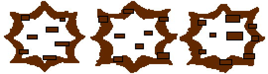

# 프로젝트명: Path Patrol (Devloper : 박수영)

# [ 목차 ]

### 1. [컨셉](#1)
#####  1-1. [메인 컨셉](#1-1)
#####  1-2. [서브 컨셉1](#1-2)
#####  1-3. [서브 컨셉2](#1-3)
#####  1-4. [서브 컨셉3](#1-4)
#####  1-5. [서브 컨셉4](#1-5)
#####  1-6. [서브 컨셉5](#1-6)
### 2. [관련 이미지와 동영상](#2)
### 3. [대표 이미지](#3)
### 4. [컨셉 & 대표이미지 기반 작품묘사](#4)
### 5. [Path Patrol 구성 요소](#5)
#####  5-1. [메커니즘](#5-1)
#####  5-2. [이야기](#5-2)
#####  5-3. [미적요소](#5-3)
#####  5-4. [기술](#5-4)
### 6. [게임 시스템 디자인](#6)
#####  6-a. [게임 오브젝트 분해 (구성 요소 분석)](#6-1)
#####  6-b. [파라미터(속성) 뽑아 보기](#6-2)
#####  6-c. [행동 뽑아 보기](#6-3)
#####  6-d. [상태 뽑아 보기](#6-4)
#####  6-e. [플레이어 캐릭터 속성(파라미터)](#6-5)
#####  6-f. [게임의 규칙](#6-6)
#####  6-g. [게임에서 사용될 공식](#6-7)

# [컨셉]

## [메인 컨셉 : 장애물]

- 사람이 무언가를 진행하는 데 방해하는 요소. 플레이어가 이 장애물을 회피하면서 게임을 진행해야함. 회피하지 않으면 목숨을 잃으며 목숨을 모두 잃을 경우 게임에서 패배하기 때문.

### [서브 컨셉 1 : 집중도]

- 장애물이 자신에게 오기 때문에 어느 타이밍에 피해야 하는 지 장애물을 봐야 하기 때문에 집중해야 함. 집중하지 못하면 라이프를 잃으며, 라이프를 모두 잃으면 게임에서 패배하기 때문.

### [서브 컨셉 2 : 몰입도]

- 장애물을 피하면서 나아가야 하기 때문에 게임에 몰입하게 된다. 또한, 플레이에 도움이 되는 아이템을 구입하기 위해서 다가오는 재화를 얻어야 하는 생각을 가지게 한다.

### [서브 컨셉 3 : 다양성]

- 장애물이 하나가 아니기 때문에 플레이어는 다양한 장애물을 피해야 한다. 다양한 장애물들의 이동 방식을 파악하여 그에 맞는 행동을 취해야 한다.

### [서브 컨셉 4 : 효과]

- 장애물을 피하기 위해서 이동을 할 때 그냥 좌표만 바뀌는 것 보단 효과를 주어서 키가 눌려져서 이동했다는 것을 확실하게 인식하게 하며, 장애물이 가까이에 있으면 플레이어에게서 붉은 빛이 나게 하여 위험하다는 것을 각인시키게 한다.

### [서브 컨셉 5 : 간단한 조작]

- 조작하기 위한 키를 최소한으로 하여 게임을 플레이 하는 데 컨트롤에 많은 지장을 주지 않게 하며, 게임을 쉽게 이해하도록 함.

  

# [관련 이미지 & 동영상]

- 이미지  
  
- 동영상
  
  

  

# [대표 이미지]

  

# [컨셉 & 대표이미지 기반 작품묘사]

> ### 대표이미지 기반 :
(UI구성) 화면의 장애물에 집중이 잘 되기 위해 화면에 뜨는 UI를 최소화할 예정입니다.

(배경) 배경은 우주와 비슷하게 몽환적인 분위기를 가진 배경을 사용할 예정입니다.

(화면 중앙) 화면 중앙에는 캐릭터, 장애물, 재화가 표시될 예정입니다.

(화면 상단) 화면 상단에는 메뉴, 자신의 목숨, 현재 자신이 가진 재화, 착용 중인 아이템이 표시됩니다.

> ### 컨셉 기반:

(캐릭터) 캐릭터는 화면 좌측에 위치해 있으며, 다가오는 장애물을 피하기 위해 몰입도를 증가시키며 간단하게 조작하기 위하여 위 아래로만 움직일 수 있게 되어 있습니다.

(장애물) 장애물은 화면 우측에서 부터 좌측에서 이동하며, 장애물은 종류에 따라서 색깔이나 모양을 다르게 하게 할 예정입니다.

(재화) 재화 또한 장애물 처럼 우측에서 부터 좌측으로 이동하며, 캐릭터가 재화에 가까이 가면 재화를 얻는 식으로 할 예정입니다.

(집중) 플레이어는 게임 플레이에 도움이 되기 위한 아이템을 사기 위한 얻어야 할 재화, 피해야 하는 장애물이 어디에 있는 지 파악해야 하기 때문에 게임에 대한 집중도를 높일 예정입니다.

  

# [ Path Patrol 구성 요소]

- Path Patrol

 

## 1. 메커니즘

[도전 과제]

1. 위 또는 아래 방향으로 즉시 이동하는 방식으로 캐릭터가 있는 방향으로 다가오는 장애물을 피한다.
2. 장애물이 우측에서 좌측으로 이동하는 거리를 길게 하여 장애물이 현재 어디에 어떤 형태의 장애물들이 있는지 인식할 수 있다.
3. 스테이지 마다 각각 살아 남아야 하는 시간 동안 목숨 세 개를 모두 잃지 않고 살아 남으면 스테이지 클리어

[재미 요소]

1. 각각의 스테이지 마다 목숨을 잃은 값에 반비례하여 별을 준다. 별을 얻음으로서 게임을 마스터한다는 목적을 가질 수 있다.
2. 스테이지의 별을 모으는 것 말고도 파괴 가능한 장애물을 스테이지에서 모두 파괴하는 업적을 만들어 업적을 달성하는 욕구를 가질 수 있게 한다.
3. 스테이지를 진행할 수록 다양한 장애물과 장애물이 다가오는 속도가 빨라지게 하여 게임이 시시하지 않게 만든다.
4. 스테이지를 플레이 하면서 얻거나 스테이지를 클리어 하여 얻은 재화로 아이템을 사서 어렵다고 생각되는 스테이지를 수월하게 클리어 할 수 있다.

 

## 2. 이야기

[만들게 된 배경]  
멈추지 않고 날아가며 통로를 순찰해야 하는데 순찰을 방해하는 장애물들을 추가하여 장애물 피하기 게임이 되었습니다.

[카메라 관점]  
3인칭 시점으로 캐릭터만 보이는 게 아닌 현재 장애물들이 있는 지점을 파악할 수도 있습니다.

 

## 3. 미적요소

[디자인] 
캐릭터 : 캐릭터는 추진기를 통해 무중력 상태의 통로를 순찰하는 스토리를 가졌기 때문에 추진기를 착용한 인간의 모습을 사용할 예정입니다.

장애물 : 장애물은 안개나 구름의 형태로 만들 예정이며, 도트로 제작할 예정입니다.

재화 : 재화의 경우에는 반짝이는 작은 빛의 형태로 만들 예정입니다.

아이템 : 아이템 같은 경우에는 미래 형식으로 던지는 기체의 형태가 담겨진 캡슐의 형태로 만들 예정입니다.

인게임 UI 디자인 : 기계적인 형태를 나타내기 위해 버튼 및 목숨이나 재화 그리고 메뉴 버튼을 파이프가 연결되어 직사각형의 형태를 띄게 할 예정입니다.

위쪽에는 차례로 현재 아이템, 현재 스테이지의 시간의 지남을 바로 표시하고, 목숨, 재화, 메뉴를 표기할 예정입니다.

배경화면 디자인 : 차원의 통로라는 세계관을 가지기 때문에 몽환적인 효과를 주기 위해 우주 배경을 사용할 예정입니다.

[컬러]

장애물들은 다양한 종류가 있기 때문에 각각 색깔을 검은색, 푸른색, 붉은색, 회색으로 색을 다르게 변경할 예정입니다.

또한 아이템도 네 가지이며, 각각 효과가 다르기 때문에 내부의 기체의 색깔을 붉은색, 초록색, 노란색, 파란색으로 나타낼 예정입니다.

[음향]  
캐릭터가 위 아래로 이동하는 것이 단거리 순간이동 방식을 사용하기 때문에, 순간이동을 한 소리를 추가할 예정입니다.

스테이지의 배경음악은 잔잔하면서 신비로운 음악을 넣어 신비로운 공간에 있는 기분이 나게 할 예정입니다.

스테이지나 옵션, 상점으로 가는 버튼들에도 "삐빅"하는 효과음을 넣을 예정입니다.
 

## 4. 기술
2D PC 게임으로 유니티를 사용하여 제작할 예정이며, 높은 사양이 컴퓨터가 아니더라도 실행에 지장이 없게 만들 예정입니다. 모든 오브젝트는 도트로 제작할 예정입니다.

# [ 게임 시스템 디자인 ]
## a. [게임 오브젝트 분해]

|연번|오브젝트 이름|오브젝트 이미지|
|:----:|:----:|:----:|
|1|주인공(Charactor)||
|2|진행도(Process_bar)||
|3|체력(Health)||
|4|회복 가스(Healing_Gas)||
|5|보호막 가스(Shield_Gas)||
|6|부활 가스(Revive_Gas)||
|7|차원막 파편(Dimension_Piece)||
|8|레슈 물질(ReSu)||
|9|응측된 레슈 물질(UpReSu)||
|10|약화된 레슈 물질(WeakenReSu)||
|11|큰 레슈 물질(BigReSu)||
|12|움직이는 레슈 물질(MovingReSu)||
|13|미확인 레슈 감염 괴수(Unknown_ReSu-Infested_Monster)||
|14|화살(Arrow)||
|15|메뉴(Menu)||
|16|스테이지 선택(Stage_Select)||
|17|스테이지 최고 점수(Stage_HightScore)||

## b. [파라미터(속성) 뽑아 보기]

1) 오브젝트 이름 : ReSu, UpReSu, WeakenReSu, BigReSu, MovingReSu

|속성|영문명칭|설명|
|:----:|:----:|:----:|
|속도|Speed|개체가 왼쪽으로 이동 할 때의 속도 수치|
|공격력|Damage|개체가 플레이어가 닿을 경우 주는 대미지의 수치|
|위치|Location|현 개체의 위치|
|상태|Status|현 개체가 왼쪽으로 완전히 도착했을 때의 bool 변수|

2) 오브젝트 이름 : Unknown ReSu-Infested Monster

|속성|영문명칭|설명|
|:----:|:----:|:----:|
|체력|Health|현 개체의 체력|
|상태|Status|현 개체의 무적 상태, 공격 상태 여부|
|위치|Location|현 개체의 위치( 플레이어의 공격 범위 안인지 )|
|공격|Attack|현 개체가 어디에 장애물을 소환하는 지 판단하는 변수|
|쿨다운|CoolDown|현 개체의 공격의 딜레이|
|모드 쿨다운|M_CoolDown|현 개체의 현재 무적 혹은 공격 상태의 유지 시간|
|추가 공격 쿨다운|PA_CoolDown|공격 모드에서 또 하나의 공격의 딜레이|

3) 오브젝트 이름 : Arrow

|속성|영문명칭|설명|
|:----:|:----:|:----:|
|속도|Speed|현 개체의 속도|
|위치|Location|현 개체의 위치( 플레이어의 공격 범위 안인지 )|

## c. [행동 뽑아 보기]

1) 오브젝트 이름 : Charactor

|행동|영문명칭|설명|
|:----:|:----:|:----:|
|위로 이동|Move_Up|플레이어가 ↑키를 누르면 위 레일로 이동한다.|
|아래로 이동|Move_Down|플레이어가 ↓키를 누르면 아래 레일로 이동한다.|
|공격|Attack|플레이어가 Space키를 누르면 화살을 자신의 위치에서 소환.|
|회복 아이템 사용|Item_Use1|플레이어가 1키를 누르면 아이템 하나를 소비하여 체력을 하나 회복.|
|보호막 아이템 자동 사용|Item_Use2|플레이어가 장애물 피격 당할 경우, 아이템 하나를 소비하여 피격을 무시하고 잠시 동안 무적 상태.|
|부활 아이템 자동 사용|Item_Use3|플레이어가 체력을 모두 잃으면 아이템 하나를 소비하여 체력을 1로 회복 후 잠시 동안 무적 상태.|
|피격|Damaged|플레이어가 장애물에 피격 당했을 경우 그 장애물의 공격력 만큼 체력 감소.|
|무적 상태|Invincibility|플레이어가 2초 동안 장애물에 피격 당하지 않은 상태가 된다.|

2) 오브젝트 이름 : ReSu, UpReSu, BigReSu

|행동|영문명칭|설명|
|:----:|:----:|:----:|
|이동|Move|왼쪽으로 정해진 속도로 이동한다.|
|피격|Collsion|플레이어와 충돌할 경우 플레이어에게 정해진 공격력 만큼 피해를 주고 삭제한다.|
|도착|Arrival|왼쪽으로 완전히 도달하면 삭제한다.|

3) 오브젝트 이름 : MovingReSu

|행동|영문명칭|설명|
|:----:|:----:|:----:|
|이동|Move|왼쪽으로 정해진 속도로 이동한다.|
|피격|Collsion|플레이어와 충돌할 경우 플레이어에게 정해진 공격력 만큼 피해를 주고 삭제한다.|
|도착|Arrival|왼쪽으로 완전히 도달하면 삭제한다.|
|상하 이동|Move_UD|위 아래로 정해진 속도로 레일 위, 아래 두 곳을 왕복 이동한다.|

4) 오브젝트 이름 : WeakenReSu

|행동|영문명칭|설명|
|:----:|:----:|:----:|
|이동|Move|왼쪽으로 정해진 속도로 이동한다.|
|피격|Collsion|플레이어와 충돌할 경우 플레이어에게 정해진 공격력 만큼 피해를 주고 삭제한다.|
|도착|Arrival|왼쪽으로 완전히 도달하면 삭제한다.|
|파괴|Destroy|플레이어의 공격에 충돌하여 파괴된다.|

5) 오브젝트 이름 : Unknown_ReSu-Infested_Monster

|행동|영문명칭|설명|
|:----:|:----:|:----:|
|모드 변환|Mode_Change|현재 유지 쿨다운 시간이 0이 될 경우, 다른 패턴을 가진 모드로 바꾼다.|
|무적 모드|Invincibility_Mode|플레이어의 공격 사거리에 닿지 않은 오른쪽으로 후퇴한다.|
|공격 모드|Attack_Mode|플레이어의 공격 사거리가 닿는 앞쪽으로 이동하며, 공격 쿨다운이 0이 되면, 레일 3가지 중 랜덤하게 약화된 레슈 물질 오브젝트를 소환한다.|
|추가 공격|Second_Attack|공격 모드일 경우 추가 공격 쿨다운이 0일 경우에 레일 3가지 중 랜덤하게 약화된 레슈 물질 오브젝트를 소환.|
|파괴|Death|프로세스 바가 100%가 되면 사망 처리한다.|

6) 오브젝트 이름 : Dimension_Piece

|행동|영문명칭|설명|
|:----:|:----:|:----:|
|이동|Move|왼쪽으로 정해진 속도로 이동한다.|
|획득|Get|플레이어와 충돌할 경우 플레이어의 재화에 + 1이 되며, 자신을 삭제한다.|
|도착|Arrival|왼쪽으로 완전히 도달하면 삭제한다.|

7) 오브젝트 이름 : Arrow

|행동|영문명칭|설명|
|:----:|:----:|:----:|
|이동|Move|오른쪽으로 정해진 속도로 이동한다.|
|충돌|Collision|약화된 레슈 물질, 공격 모드의 보스와 충돌하면 그 오브젝트에 피해를 주고 삭제한다.|
|도착|Arrival|왼쪽으로 완전히 도달하면 삭제한다.|

## d. [상태 뽑아 보기]

1) 오브젝트 이름 : Charator

|현 상태|전이 상태|전이 조건|
|:----:|:----:|:----:|
|Process( 진행 상태 )|Process( 진행 상태 )|아무 행동도 취하지 않은 상태|
|Process( 진행 상태 )|위로 이동|↑키를 누를 경우|
|Process( 진행 상태 )|아래로 이동|↓키를 누를 경우|
|Process( 진행 상태 )|전방 공격|Space 키를 누를 경우|
|Process( 진행 상태 )|무적 상태|피격을 당하거나 보호막 가스 아이템 사용이 된 경우|
|무적 상태|위로 이동|↑키를 누를 경우|
|무적 상태|아래로 이동|↓키를 누를 경우|
|무적 상태|전방 공격|Space 키를 누를 경우|
|무적 상태|Process( 진행 상태 )|무적 지속 시간이 0이 된 경우|
|무적 상태( 피격 )|사망 상태|체력이 0이 될 경우|
|사망 상태|무적 상태|사망 상태에서 부활 가스가 있을 경우|

2) 오브젝트 이름 : ReSu, UpReSu, BigReSu

|현 상태|전이 상태|전이 조건|
|:----:|:----:|:----:|
|Process( 진행 상태 )|Process( 진행 상태 )|왼쪽으로 이동하는 상태|
|Process( 진행 상태 )|충돌 상태|플레이어와 충돌한 경우|
|Process( 진행 상태 )|도착 상태|왼쪽 화면 끝으로 완전히 도달한 경우|

3) 오브젝트 이름 : MovingReSu

|현 상태|전이 상태|전이 조건|
|:----:|:----:|:----:|
|Process( 진행 상태 )|Process( 진행 상태 )|왼쪽, 상하로 이동하는 경우|
|Process( 진행 상태 )|충돌 상태|플레이어와 충돌한 경우|
|Process( 진행 상태 )|도착 상태|왼쪽 화면 끝으로 완전히 도달한 경우|

4) 오브젝트 이름 : WeakenReSu

|현 상태|전이 상태|전이 조건|
|:----:|:----:|:----:|
|Process( 진행 상태 )|Process( 진행 상태 )|왼쪽, 상하로 이동하는 경우|
|Process( 진행 상태 )|충돌 상태|플레이어와 충돌한 경우|
|Process( 진행 상태 )|도착 상태|왼쪽 화면 끝으로 완전히 도달한 경우|
|Process( 진행 상태 )|파괴 상태|플레이어의 공격에 피격당할 경우|

5) 오브젝트 이름 : Unknown_ReSu-Infested_Monster

|현 상태|전이 상태|전이 조건|
|:----:|:----:|:----:|
|무적 모드|공격 모드|무적 모드일 때 모드 쿨다운이 0이 된 경우|
|공격 모드|무적 모드|공격 모드일 때 모드 쿨다운이 0이 된 경우|
|공격 모드|공격 상태|공격 모드일 때 공격 쿨다운이 0이 된 경우|
|공격 모드|추가 공격 상태|공격 모드일 때 추가 공격 쿨다운이 0이 된 경우|
|공격 모드|사망 상태|공격 모드일 때 프로세스 바가 100%가 된 경우|

6) 오브젝트 이름 : Dimension_Piece

|현 상태|전이 상태|전이 조건|
|:----:|:----:|:----:|
|Process( 진행 상태 )|Process( 진행 상태 )|왼쪽, 상하로 이동하는 상태|
|Process( 진행 상태 )|충돌 상태|플레이어와 충돌한 경우|
|Process( 진행 상태 )|도착 상태|왼쪽 화면 끝으로 완전히 도달한 경우|

7) 오브젝트 이름 : Arrow

|현 상태|전이 상태|전이 조건|
|:----:|:----:|:----:|
|Process( 진행 상태 )|Process( 진행 상태 )|오른쪽으로 이동하는 상태|
|Process( 진행 상태 )|충돌 상태|WeakenReSu, Unknown_ReSu-Infested_Monster에 피격될 경우|
|Process( 진행 상태 )|도착 상태|플레이어의 최대 사거리에 도달한 경우|

## e. [플레이어 캐릭터 속성(파라미터)]

|속성|영문명칭|설명|
|:----:|:----:|:----:|
|체력|Health|현재 플레이어의 체력 수치|
|상태|Status|플레이어가 충돌 판정을 지닌 상태인지 여부 파악|
|위치|Location|현재 플레이어의 위치|
|공격력|Damage|플레이어의 공격으로 줄 수 있는 대미지의 수치|
|도달 상태|Process|현재 플레이어의 도달 상태|
|사거리|Range|플레이어의 공격이 닿는 사거리|

## f. [게임의 규칙]
1) 핵심 규칙
승리 조건 :
 - 보스 스테이지가 아닐 경우 : 정해진 시간에 체력이 0이 되지 않은 상태인 경우
 - 보스 스테이지일 경우 : 플레이어의 공격으로 적 체력이 0이 될 경우
패배 조건 :
 - 보스 스테이지가 아닐 경우 : 정해진 시간에 도달하지 않은 상태에서 체력이 0이며, 부활 가스의 기회가 0이 될 경우
 - 보스 스테이지일 경우 : 보스를 처치하지 못한 상태에서 체력이 0이며, 부활 가스의 기회가 0이 될 경우

이동 방식 :
 - 플레이어 : 레일이 있으면 레일에 고정되어 있으며, 위와 아래 방향키를 눌러서 Y좌표가 한 순간에 바뀌어 다른       레일로 이동하는 방식을 사용.
 - 장애물 : 레일에서 움직이는 것처럼 움직이는 레슈 물질, 보스인 미확인 레슈 감염 괴수를 제외한 적 오브젝트,        재화인 차원막 조각은 왼쪽으로 직진하여 이동한다.

체력 : 초반 체력은 3개이며, 장애물에 피격된 경우 장애물이 가진 공격력(1, 2)만큼 체력을 잃는다.

공격 : Space키를 눌러 최대 사거리만큼 오른쪽으로 계속해서 이동하는 화살을 발사한다.
 - WeakenReSu : 피격될 경우 파괴된다.
 - Unknown_ReSu-Infested_Monster : 피격될 경우 프로세스 바의 1%을 상승시킨다.

무적 : 캐릭터가 장애물에 무적 상태일 경우, 어떤 장애물에도 피격되지 않은 상태가 된다.

재화 : 스테이지 클리어 혹은 스테이지를 진행하면서 재화를 얻을 수 있다.

아이템 :  얻은 재화로 상점에서 아이템을 구매할 수 있다. 최대 보유 개수와 가격, 사용법은 이하와 같다.
 - 회복 가스 : 5개, 가격 : 차원막 조각 10개, 스테이지 플레이 도중 체력이 2 이하일 경우
 - 보호막 가스 : 3개, 가격 : 차원막 조각 25개, 스테이지 플레이 도중 피격 당할 경우 자동으로 사용
 - 부활 가스 : 1개, 가격 : 차원막 조각 50개, 스테이지 플레이 도중 사망 시 자동으로 사용

2) 보조 규칙
스테이지 스코어 : 다음과 같은 조건 만족한 수에 따라서 스테이지 마다 스코어인 별을 지급한다.
 - 피해를 입지 않음
 - 부활 가스를 사용하지 않음
 - 보호막 가스를 사용하지 않음

## g. [게임에서 사용될 공식]
1) 스테이지에 사용되는 공식
 - 만약 플레이어의 체력이 0이며, 부활 가스를 소지하지 않을 경우 -> 스테이지 패배
 - 만약 일정 시간까지 도달했으며, 체력이 1 이상일 경우 -> 스테이지 클리어 및 차원막 조각 지급
  + 만약 피해를 입지 않고 클리어를 한 경우 -> 스테이지 스코어 + 1
  + 만약 부활 가스를 사용하지 않았을 경우 -> 스테이지 스코어 + 1
  + 만약 보호막 가스를 사용하지 않았을 경우 -> 스테이지 스코어 + 1
  -> 계산된 스테이지 스코어를 해당 스테이지에 부여

 - 만약 보스 스테이지이며, 프로세스가 100%며, 체력이 1 이상일 경우 -> 스테이지 클리어 및 차원막 조각 지급
  + 만약 피해를 입지 않고 클리어를 한 경우 -> 스테이지 스코어 + 1
  + 만약 부활 가스를 사용하지 않았을 경우 -> 스테이지 스코어 + 1
  + 만약 보호막 가스를 사용하지 않았을 경우 -> 스테이지 스코어 + 1
  -> 계산된 스테이지 스코어를 해당 스테이지에 부여

2) 충돌 관련 공식
 - 만약 플레이어가 레슈 물질에 닿을 경우 -> 플레이어의 체력 1 감소, 해당 레슈 물질 삭제
 - 만약 플레이어가 응축된 레슈 물질에 닿을 경우 -> 플레이어의 체력 2 감소, 해당 응축된 레슈 물질 삭제
 - 만약 플레이어가 약화된 레슈 물질에 닿을 경우 -> 플레이어의 체력 1 감소, 해당 약화된 레슈 물질 삭제
 - 만약 플레이어가 큰 레슈 물질에 닿을 경우 -> 플레이어의 체력 1 감소, 해당 큰 레슈 물질 삭제
 - 만약 플레이어가 움직이는 레슈 물질에 닿을 경우 -> 플레이어의 체력 1감소, 해당 움직이는 레슈 물질 삭제
 - 만약 플레이어가 차원막 조각에 닿을 경우 -> 플레이어의 보유 차원막 조각 + 1, 해당 차원막 조각 삭제
 
 - 만약 화살이 약화된 레슈 물질에 닿을 경우 -> 충돌한 약화된 레슈 물질 삭제, 해당 화살 삭제
 - 만약 화살이 미확인 레슈 감염 괴수에 닿을 경우 -> 프로세스 1% 상승, 해당 화살 삭제

3) 이동 관련 공식
 - 만약 지정된 Y좌표가 2개이며, 위 키를 눌렀으며, 플레이어가 아래 좌표에 있을 경우 -> 플레이어를 위 좌표로       이동한다.
 - 만약 지정된 Y좌표가 2개이며, 아래 키를 눌렀으며, 플레이어가 위 좌표에 있을 경우 -> 플레이어를 아래 좌표로     이동한다.

 - 만약 지정된 Y좌표가 3개이며, 위 키를 눌렀으며, 플레이어가 중앙 좌표에 있을 경우 -> 플레이어를 위 좌표로       이동시킨다.
 - 만약 지정된 Y좌표가 3개이며, 위 키를 눌렀으며, 플레이어가 아래 좌표에 있을 경우 -> 플레이어를 중앙 좌표로     이동시킨다.
 - 만약 지정된 Y좌표가 3개이며, 아래 키를 눌렀으며, 플레이어가 중앙 좌표에 있을 경우 -> 플레이어를 아래 좌표로     이동시킨다.
 - 만약 지정된 Y좌표가 3개이며, 아래 키를 눌렀으며, 플레이어가 위 좌표에 있을 경우 -> 플레이어를 중앙 좌표로     이동시킨다.

4) 아이템 관련 공식
 - 만약 플레이어가 1키를 눌렀으며, 회복 가스 보유 수가 1개 이상이며, 체력이 1개 또는 2개일 경우 -> 회복 가스     보유 수를 1개 줄이고, 체력을 1 증가시킨다.
 - 만약 플레이어가 피격 당하며, 보호막 가스 보유 수가 1개 이상일 경우 -> 보호막 가스 보유 수를 1개 줄이고,        무적 상태를 유지한다. ( 장애물 충돌 스크립트가 아니기 때문에, 장애물 충돌의 체력 감소 코드는 작동하지           않는다. )
 - 만약 플레이어의 체력이 0이며, 부활 가스 보유 수가 1개 일 경우 -> 체력을 1로 하고, 부활 가스 보유 수를         0으로 하고, 무적 상태로 만든다.

 5) 무적 관련 공식
  - 만약 플레이어의 무적 상태가 켜진 경우 -> 2초 후 무적 상태를 해제한다.
