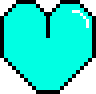
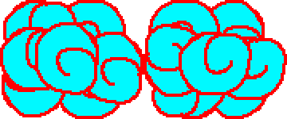

# 프로젝트명: Path Patrol (Devloper : 박수영)

# [ 목차 ]

### 1. [컨셉](#1)
#####  1-1. [메인 컨셉](#1-1)
#####  1-2. [서브 컨셉1](#1-2)
#####  1-3. [서브 컨셉2](#1-3)
#####  1-4. [서브 컨셉3](#1-4)
#####  1-5. [서브 컨셉4](#1-5)
#####  1-6. [서브 컨셉5](#1-6)
### 2. [관련 이미지와 동영상](#2)
### 3. [대표 이미지](#3)
### 4. [컨셉 & 대표이미지 기반 작품묘사](#4)
### 5. [Path Patrol 구성 요소](#5)
#####  5-1. [메커니즘](#5-1)
#####  5-2. [이야기](#5-2)
#####  5-3. [미적요소](#5-3)
#####  5-4. [기술](#5-4)
### 6. [게임 시스템 디자인](#6)

# [컨셉]

## 메인 컨셉 : 장애물<b name='1-1'></b>

- 사람이 무언가를 진행하는 데 방해하는 요소. 플레이어가 이 장애물을 회피하면서 게임을 진행해야함. 회피하지 않으면 목숨을 잃으며 목숨을 모두 잃을 경우 게임에서 패배하기 때문.

### 서브 컨셉 1 : 집중도<b name='1-2'></b>

- 장애물이 자신에게 오기 때문에 어느 타이밍에 피해야 하는 지 장애물을 봐야 하기 때문에 집중해야 함. 집중하지 못하면 라이프를 잃으며, 라이프를 모두 잃으면 게임에서 패배하기 때문.

### 서브 컨셉 2 : 몰입도<b name='1-3'></b>

- 장애물을 피하면서 나아가야 하기 때문에 게임에 몰입하게 된다. 또한, 플레이에 도움이 되는 아이템을 구입하기 위해서 다가오는 재화를 얻어야 하는 생각을 가지게 한다.

### 서브 컨셉 3 : 다양성<b name='1-4'></b>

- 장애물이 하나가 아니기 때문에 플레이어는 다양한 장애물을 피해야 한다. 다양한 장애물들의 이동 방식을 파악하여 그에 맞는 행동을 취해야 한다.

### 서브 컨셉 4 : 효과<b name='1-5'></b>

- 장애물을 피하기 위해서 이동을 할 때 그냥 좌표만 바뀌는 것 보단 효과를 주어서 키가 눌려져서 이동했다는 것을 확실하게 인식하게 하며, 장애물이 가까이에 있으면 플레이어에게서 붉은 빛이 나게 하여 위험하다는 것을 각인시키게 한다.

### 서브 컨셉 5 : 간단한 조작<b name='1-6'></b>

- 조작하기 위한 키를 최소한으로 하여 게임을 플레이 하는 데 컨트롤에 많은 지장을 주지 않게 하며, 게임을 쉽게 이해하도록 함.

  

# [관련 이미지 & 동영상]

- 이미지  
  
- 동영상
  
  

  

# [대표 이미지]

  

# [컨셉 & 대표이미지 기반 작품묘사]

> ### 대표이미지 기반 :
(UI구성) 화면의 장애물에 집중이 잘 되기 위해 화면에 뜨는 UI를 최소화할 예정입니다.

(배경) 배경은 우주와 비슷하게 몽환적인 분위기를 가진 배경을 사용할 예정입니다.

(화면 중앙) 화면 중앙에는 캐릭터, 장애물, 재화가 표시될 예정입니다.

(화면 상단) 화면 상단에는 메뉴, 자신의 목숨, 현재 자신이 가진 재화, 착용 중인 아이템이 표시됩니다.

> ### 컨셉 기반:

(캐릭터) 캐릭터는 화면 좌측에 위치해 있으며, 다가오는 장애물을 피하기 위해 몰입도를 증가시키며 간단하게 조작하기 위하여 위 아래로만 움직일 수 있게 되어 있습니다.

(장애물) 장애물은 화면 우측에서 부터 좌측에서 이동하며, 장애물은 종류에 따라서 색깔이나 모양을 다르게 하게 할 예정입니다.

(재화) 재화 또한 장애물 처럼 우측에서 부터 좌측으로 이동하며, 캐릭터가 재화에 가까이 가면 재화를 얻는 식으로 할 예정입니다.

(집중) 플레이어는 게임 플레이에 도움이 되기 위한 아이템을 사기 위한 얻어야 할 재화, 피해야 하는 장애물이 어디에 있는 지 파악해야 하기 때문에 게임에 대한 집중도를 높일 예정입니다.

  

# [ Path Patrol 구성 요소]

- Path Patrol

 

## 1. 메커니즘<b name='5-1'></b>

[도전 과제]

1. 위 또는 아래 방향으로 즉시 이동하는 방식으로 캐릭터가 있는 방향으로 다가오는 장애물을 피한다.
2. 장애물이 우측에서 좌측으로 이동하는 거리를 길게 하여 장애물이 현재 어디에 어떤 형태의 장애물들이 있는지 인식할 수 있다.
3. 스테이지 마다 각각 살아 남아야 하는 시간 동안 목숨 세 개를 모두 잃지 않고 살아 남으면 스테이지 클리어

[재미 요소]

1. 각각의 스테이지 마다 목숨을 잃은 값에 반비례하여 별을 준다. 별을 얻음으로서 게임을 마스터한다는 목적을 가질 수 있다.
2. 스테이지의 별을 모으는 것 말고도 파괴 가능한 장애물을 스테이지에서 모두 파괴하는 업적을 만들어 업적을 달성하는 욕구를 가질 수 있게 한다.
3. 스테이지를 진행할 수록 다양한 장애물과 장애물이 다가오는 속도가 빨라지게 하여 게임이 시시하지 않게 만든다.
4. 스테이지를 플레이 하면서 얻거나 스테이지를 클리어 하여 얻은 재화로 아이템을 사서 어렵다고 생각되는 스테이지를 수월하게 클리어 할 수 있다.

 

## 2. 이야기<b name='5-2'></b>

[만들게 된 배경]  
멈추지 않고 날아가며 통로를 순찰해야 하는데 순찰을 방해하는 장애물들을 추가하여 장애물 피하기 게임이 되었습니다.

[카메라 관점]  
3인칭 시점으로 캐릭터만 보이는 게 아닌 현재 장애물들이 있는 지점을 파악할 수도 있습니다.

 

## 3. 미적요소<b name='5-3'></b>

[디자인] 
캐릭터 : 캐릭터는 추진기를 통해 무중력 상태의 통로를 순찰하는 스토리를 가졌기 때문에 추진기를 착용한 인간의 모습을 사용할 예정입니다.

장애물 : 장애물은 안개나 구름의 형태로 만들 예정이며, 도트로 제작할 예정입니다.

재화 : 재화의 경우에는 반짝이는 작은 빛의 형태로 만들 예정입니다.

아이템 : 아이템 같은 경우에는 미래 형식으로 던지는 기체의 형태가 담겨진 캡슐의 형태로 만들 예정입니다.

인게임 UI 디자인 : 기계적인 형태를 나타내기 위해 버튼 및 목숨이나 재화 그리고 메뉴 버튼을 파이프가 연결되어 직사각형의 형태를 띄게 할 예정입니다.

위쪽에는 차례로 현재 아이템, 현재 스테이지의 시간의 지남을 바로 표시하고, 목숨, 재화, 메뉴를 표기할 예정입니다.

배경화면 디자인 : 차원의 통로라는 세계관을 가지기 때문에 몽환적인 효과를 주기 위해 우주 배경을 사용할 예정입니다.

[컬러]

장애물들은 다양한 종류가 있기 때문에 각각 색깔을 검은색, 푸른색, 붉은색, 회색으로 색을 다르게 변경할 예정입니다.

또한 아이템도 네 가지이며, 각각 효과가 다르기 때문에 내부의 기체의 색깔을 붉은색, 초록색, 노란색, 파란색으로 나타낼 예정입니다.

[음향]  
캐릭터가 위 아래로 이동하는 것이 단거리 순간이동 방식을 사용하기 때문에, 순간이동을 한 소리를 추가할 예정입니다.

스테이지의 배경음악은 잔잔하면서 신비로운 음악을 넣어 신비로운 공간에 있는 기분이 나게 할 예정입니다.

스테이지나 옵션, 상점으로 가는 버튼들에도 "삐빅"하는 효과음을 넣을 예정입니다.
 

## 4. 기술<b name='5-4'></b>
2D PC 게임으로 유니티를 사용하여 제작할 예정이며, 높은 사양이 컴퓨터가 아니더라도 실행에 지장이 없게 만들 예정입니다. 모든 오브젝트는 도트로 제작할 예정입니다.

# [ 게임 시스템 디자인 ]
## a. 게임 오브젝트 분해
|연번|오브젝트 이름|오브젝트 이미지|
|:----:|:----:|:----:|
|1|주인공(Charactor)||
|2|진행도(Process_bar)||
|3|체력(Health)||
|4|회복 가스(Healing_Gas)||
|5|보호막 가스(Shield_Gas)||
|6|부활 가스(Revive_Gas)||
|7|차원막 파편(Dimension_Piece)||
|8|레슈 물질(ReSu)||
|9|응측된 레슈 물질(UpReSu)||
|10|약화된 레슈 물질(WeakenReSu)||
|11|큰 레슈 물질(BigReSu)||
|12|움직이는 레슈 물질(MovingReSu)||
|13|미확인 레슈 감염 괴수(Unknown_ReSu-Infested_Monster)||
|14|화살(Arrow)||
|15|메뉴(Menu)||
|16|스테이지 선택(Stage_Select)||
|17|스테이지 최고 점수(Stage_HightScore)||
