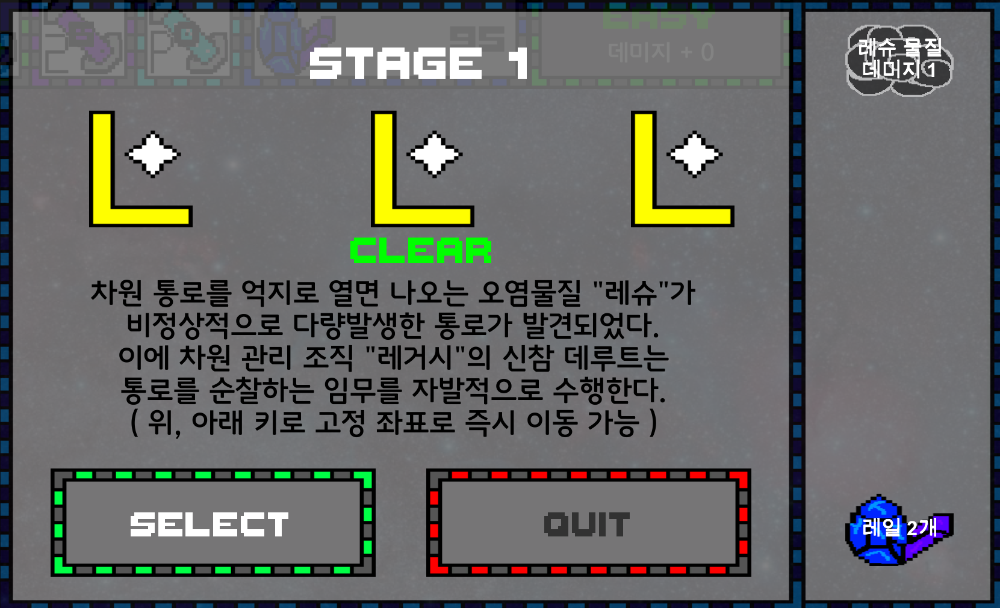

# 프로젝트명: Path Patrol (Devloper : 박수영)

# [ 목차 ]

### 1. [컨셉](#1)
### 2. [관련 이미지와 동영상](#2)
### 3. [대표 이미지](#3)
### 4. [컨셉 & 대표이미지 기반 작품묘사](#4)
### 5. [Path Patrol 구성 요소](#5)
#####  5-1. [메커니즘](#5-1)
#####  5-2. [이야기](#5-2)
#####  5-3. [미적요소](#5-3)
#####  5-4. [기술](#5-4)
### 6. [게임 시스템 디자인](#6)
#####  6-a. [게임 오브젝트 분해 (구성 요소 분석)](#6-1)
#####  6-b. [파라미터(속성) 뽑아 보기](#6-2)
#####  6-c. [행동 뽑아 보기](#6-3)
#####  6-d. [상태 뽑아 보기](#6-4)
#####  6-e. [플레이어 캐릭터 속성(파라미터)](#6-5)
#####  6-f. [게임의 규칙](#6-6)
#####  6-g. [게임에서 사용될 공식](#6-7)
### 7. [요구사항](#7)
### 8. [이벤트 흐름도](#8)
### 9. [스토리보드](#9)
### 10. [프로토타입 개발 요구사항 (6주개발)](#10)
### 11. [프로토타입 개발작업 일정 (6주개발)](#11)

# [컨셉]

## 메인 컨셉 : 장애물

- 사람이 무언가를 진행하는 데 방해하는 요소. 플레이어가 이 장애물을 회피하면서 게임을 진행해야함. 회피하지 않으면 목숨을 잃으며 목숨을 모두 잃을 경우 게임에서 패배하기 때문.

### 서브 컨셉 1 : 집중도

- 장애물이 자신에게 오기 때문에 어느 타이밍에 피해야 하는 지 장애물을 봐야 하기 때문에 집중해야 함. 집중하지 못하면 라이프를 잃으며, 라이프를 모두 잃으면 게임에서 패배하기 때문.

### 서브 컨셉 2 : 몰입도

- 장애물을 피하면서 나아가야 하기 때문에 게임에 몰입하게 된다. 또한, 플레이에 도움이 되는 아이템을 구입하기 위해서 다가오는 재화를 얻어야 하는 생각을 가지게 한다.

### 서브 컨셉 3 : 다양성

- 장애물이 하나가 아니기 때문에 플레이어는 다양한 장애물을 피해야 한다. 다양한 장애물들의 이동 방식을 파악하여 그에 맞는 행동을 취해야 한다.

### 서브 컨셉 4 : 효과

- 장애물을 피하기 위해서 이동을 할 때 그냥 좌표만 바뀌는 것 보단 효과를 주어서 키가 눌려져서 이동했다는 것을 확실하게 인식하게 하며, 장애물이 가까이에 있으면 플레이어에게서 붉은 빛이 나게 하여 위험하다는 것을 각인시키게 한다.

### 서브 컨셉 5 : 간단한 조작

- 조작하기 위한 키를 최소한으로 하여 게임을 플레이 하는 데 컨트롤에 많은 지장을 주지 않게 하며, 게임을 쉽게 이해하도록 함.

  

# [관련 이미지 & 동영상]

- 이미지  
  
- 동영상
  
  

  

# [대표 이미지]

  

# [컨셉 & 대표이미지 기반 작품묘사]

> ### 대표이미지 기반 :
(UI구성) 화면의 장애물에 집중이 잘 되기 위해 화면에 뜨는 UI를 최소화할 예정입니다.

(배경) 배경은 우주와 비슷하게 몽환적인 분위기를 가진 배경을 사용할 예정입니다.

(화면 중앙) 화면 중앙에는 캐릭터, 장애물, 재화가 표시될 예정입니다.

(화면 상단) 화면 상단에는 메뉴, 자신의 목숨, 현재 자신이 가진 재화, 착용 중인 아이템이 표시됩니다.

> ### 컨셉 기반:

(캐릭터) 캐릭터는 화면 좌측에 위치해 있으며, 다가오는 장애물을 피하기 위해 몰입도를 증가시키며 간단하게 조작하기 위하여 위 아래로만 움직일 수 있게 되어 있습니다.

(장애물) 장애물은 화면 우측에서 부터 좌측에서 이동하며, 장애물은 종류에 따라서 색깔이나 모양을 다르게 하게 할 예정입니다.

(재화) 재화 또한 장애물 처럼 우측에서 부터 좌측으로 이동하며, 캐릭터가 재화에 가까이 가면 재화를 얻는 식으로 할 예정입니다.

(집중) 플레이어는 게임 플레이에 도움이 되기 위한 아이템을 사기 위한 얻어야 할 재화, 피해야 하는 장애물이 어디에 있는 지 파악해야 하기 때문에 게임에 대한 집중도를 높일 예정입니다.

  

# [ Path Patrol 구성 요소]

- Path Patrol

 

## 1. 메커니즘

[도전 과제]

1. 위 또는 아래 방향으로 즉시 이동하는 방식으로 캐릭터가 있는 방향으로 다가오는 장애물을 피한다.
2. 장애물이 우측에서 좌측으로 이동하는 거리를 길게 하여 장애물이 현재 어디에 어떤 형태의 장애물들이 있는지 인식할 수 있다.
3. 스테이지 마다 각각 살아 남아야 하는 시간 동안 목숨 세 개를 모두 잃지 않고 살아 남으면 스테이지 클리어
4. 일정 아이템을 쓰지 않으며, 목숨을 잃지 않으면 추가적으로 스테이지 스코어를 받을 수 있다

[재미 요소]

1. 각각의 스테이지 마다 해당 조건을 달성하면, 그 달성한 수만큼 별을 줘서 별을 얻는 재미를 준다.
2. 스테이지를 진행할 수록 다양한 장애물과 장애물이 다가오는 속도가 빨라지게 하여 게임이 시시하지 않게 만든다.
3. 스테이지를 플레이 하면서 얻거나 스테이지를 클리어 하여 얻은 재화로 아이템을 사서 어렵다고 생각되는 스테이지를 수월하게 클리어 할 수 있다.
4. 마지막 스테이지로는 그냥 장애물만 피하는 게임이 아닌, 스토리 상에서 장애물을 생성하는 원인인 보스를 처치한다는 임무를 주는 것으로 색다로운 플레이를 할 수 있게 한다.

 

## 2. 이야기

[만들게 된 배경]  
추진기를 이용하여 비행하는 게임을 만들려고 했는데, 거기에 장애물을 추가했으며, 멈추지 않고 날아가며 그 무중력 공간인 통로를 순찰해야 하는데
순찰을 방해하는 장애물들을 피하며, 그 원인을 제거한다는 스토리를 추가하여 장애물 피하기 게임이 되었습니다.

[카메라 관점]  
3인칭 시점으로 캐릭터만 보이는 게 아닌 현재 장애물들이 있는 지점을 파악할 수도 있습니다.

 

## 3. 미적요소

[디자인] 

공통 : 배경화면을 제외한 모든 디자인은 도트로 제작할 예정입니다.

캐릭터 : 캐릭터는 추진기를 통해 무중력 상태의 통로를 순찰하는 스토리를 가졌기 때문에 추진기를 착용한 인간의 모습을 사용할 예정입니다.

장애물 : 장애물은 안개나 구름의 형태로 만들 예정입니다.

재화 : 재화의 경우에는 보석의 형태로 만들 예정입니다.

아이템 : 아이템 같은 경우에는 미래 형식으로 던지는 기체의 형태가 담겨진 캡슐의 형태로 만들 예정입니다.

인게임 UI 디자인 : 기계적인 형태를 나타내기 위해 버튼 및 목숨이나 재화 그리고 메뉴 버튼을 파이프가 연결되어 직사각형의 형태를 띄게 할 예정입니다.

위쪽에는 차례로 현재 아이템, 현재 스테이지의 시간의 지남을 바로 표시하고, 목숨, 재화, 메뉴를 표기할 예정입니다.

배경화면 디자인 : 차원의 통로라는 세계관을 가지기 때문에 몽환적인 효과를 주기 위해 우주 배경을 사용할 예정입니다.

[컬러]

장애물들은 다양한 종류가 있기 때문에 각각 색깔을 검은색, 푸른색, 붉은색, 회색으로 색을 다르게 변경할 예정입니다.

또한 아이템도 네 가지이며, 각각 효과가 다르기 때문에 내부의 기체의 색깔을 붉은색, 초록색, 노란색, 파란색으로 나타낼 예정입니다.

[음향]  
캐릭터가 위 아래로 이동하는 것이 단거리 순간이동 방식을 사용하기 때문에, 순간이동을 한 소리를 추가할 예정입니다.

스테이지의 배경음악은 잔잔하면서 신비로운 음악을 넣어 신비로운 공간에 있는 기분이 나게 할 예정입니다.

스테이지나 옵션, 상점으로 가는 버튼들에도 "삐빅"하는 효과음을 넣을 예정입니다.
 

## 4. 기술
2D PC 게임으로 유니티를 사용하여 제작할 예정이며, 높은 사양이 컴퓨터가 아니더라도 실행에 지장이 없게 만들 예정입니다. 모든 오브젝트는 도트로 제작할 예정입니다.

# [ 게임 시스템 디자인 ]
## a. 게임 오브젝트 분해

|연번|오브젝트 이름|오브젝트 이미지|
|:----:|:----:|:----:|
|1|주인공(Charactor)||
|2|진행도(Process_bar)||
|3|체력(Health)||
|4|회복 가스(Healing_Gas)||
|5|보호막 가스(Shield_Gas)||
|6|부활 가스(Revive_Gas)||
|7|차원막 파편(Dimension_Piece)||
|8|레슈 물질(ReSu)||
|9|응측된 레슈 물질(UpReSu)||
|10|약화된 레슈 물질(WeakenReSu)||
|11|큰 레슈 물질(BigReSu)||
|12|움직이는 레슈 물질(MovingReSu)||
|13|미확인 레슈 감염 괴수(Unknown_ReSu-Infested_Monster)||
|14|화살(Arrow)||
|15|메뉴(Menu)||
|16|스테이지 선택(Stage_Select)||
|17|스테이지 최고 점수(Stage_HightScore)||

## b. 파라미터(속성) 뽑아 보기

1) 오브젝트 이름 : ReSu, UpReSu, WeakenReSu, BigReSu, MovingReSu

|속성|영문명칭|설명|
|:----:|:----:|:----:|
|속도|Speed|개체가 왼쪽으로 이동 할 때의 속도 수치|
|공격력|Damage|개체가 플레이어가 닿을 경우 주는 대미지의 수치|
|위치|Location|현 개체의 위치|
|상태|Status|현 개체가 왼쪽으로 완전히 도착했을 때의 bool 변수|

2) 오브젝트 이름 : Unknown ReSu-Infested Monster

|속성|영문명칭|설명|
|:----:|:----:|:----:|
|체력|Health|현 개체의 체력|
|상태|Status|현 개체의 무적 상태, 공격 상태 여부|
|위치|Location|현 개체의 위치( 플레이어의 공격 범위 안인지 )|
|공격|Attack|현 개체가 어디에 장애물을 소환하는 지 판단하는 변수|
|쿨다운|CoolDown|현 개체의 공격의 딜레이|
|모드 쿨다운|M_CoolDown|현 개체의 현재 무적 혹은 공격 상태의 유지 시간|
|추가 공격 쿨다운|PA_CoolDown|공격 모드에서 또 하나의 공격의 딜레이|

3) 오브젝트 이름 : Arrow

|속성|영문명칭|설명|
|:----:|:----:|:----:|
|속도|Speed|현 개체의 속도|
|위치|Location|현 개체의 위치( 플레이어의 공격 범위 안인지 )|

## c. 행동 뽑아 보기

1) 오브젝트 이름 : Charactor

|행동|영문명칭|설명|
|:----:|:----:|:----:|
|위로 이동|Move_Up|플레이어가 ↑키를 누르면 위 레일로 이동한다.|
|아래로 이동|Move_Down|플레이어가 ↓키를 누르면 아래 레일로 이동한다.|
|공격|Attack|플레이어가 Space키를 누르면 화살을 자신의 위치에서 소환.|
|회복 아이템 사용|Item_Use1|플레이어가 1키를 누르면 아이템 하나를 소비하여 체력을 하나 회복.|
|보호막 아이템 자동 사용|Item_Use2|플레이어가 장애물 피격 당할 경우, 아이템 하나를 소비하여 피격을 무시하고 잠시 동안 무적 상태.|
|부활 아이템 자동 사용|Item_Use3|플레이어가 체력을 모두 잃으면 아이템 하나를 소비하여 체력을 1로 회복 후 잠시 동안 무적 상태.|
|피격|Damaged|플레이어가 장애물에 피격 당했을 경우 그 장애물의 공격력 만큼 체력 감소. 그 후 2초 동안 |
|무적 상태|Invincibility|플레이어가 일정  동안 장애물에 피격 당하지 않은 상태가 된다.|

2) 오브젝트 이름 : ReSu, UpReSu, BigReSu

|행동|영문명칭|설명|
|:----:|:----:|:----:|
|이동|Move|왼쪽으로 정해진 속도로 이동한다.|
|피격|Collsion|플레이어와 충돌할 경우 플레이어에게 정해진 공격력 만큼 피해를 주고 삭제한다.|
|도착|Arrival|왼쪽으로 완전히 도달하면 삭제한다.|

3) 오브젝트 이름 : MovingReSu

|행동|영문명칭|설명|
|:----:|:----:|:----:|
|이동|Move|왼쪽으로 정해진 속도로 이동한다.|
|피격|Collsion|플레이어와 충돌할 경우 플레이어에게 정해진 공격력 만큼 피해를 주고 삭제한다.|
|도착|Arrival|왼쪽으로 완전히 도달하면 삭제한다.|
|상하 이동|Move_UD|위 아래로 정해진 속도로 레일 위, 아래 두 곳을 왕복 이동한다.|

4) 오브젝트 이름 : WeakenReSu

|행동|영문명칭|설명|
|:----:|:----:|:----:|
|이동|Move|왼쪽으로 정해진 속도로 이동한다.|
|피격|Collsion|플레이어와 충돌할 경우 플레이어에게 정해진 공격력 만큼 피해를 주고 삭제한다.|
|도착|Arrival|왼쪽으로 완전히 도달하면 삭제한다.|
|파괴|Destroy|플레이어의 공격에 충돌하여 파괴된다.|

5) 오브젝트 이름 : Unknown_ReSu-Infested_Monster

|행동|영문명칭|설명|
|:----:|:----:|:----:|
|모드 변환|Mode_Change|현재 유지 쿨다운 시간이 0이 될 경우, 다른 패턴을 가진 모드로 바꾼다.|
|무적 모드|Invincibility_Mode|플레이어의 공격 사거리에 닿지 않은 오른쪽으로 후퇴한다.|
|공격 모드|Attack_Mode|플레이어의 공격 사거리가 닿는 앞쪽으로 이동하며, 공격 쿨다운이 0이 되면, 레일 3가지 중 랜덤하게 약화된 레슈 물질 오브젝트를 소환한다.|
|추가 공격|Second_Attack|공격 모드일 경우 추가 공격 쿨다운이 0일 경우에 레일 3가지 중 랜덤하게 약화된 레슈 물질 오브젝트를 소환.|
|파괴|Death|프로세스 바가 100%가 되면 사망 처리한다.|

6) 오브젝트 이름 : Dimension_Piece

|행동|영문명칭|설명|
|:----:|:----:|:----:|
|이동|Move|왼쪽으로 정해진 속도로 이동한다.|
|획득|Get|플레이어와 충돌할 경우 플레이어의 재화에 + 1이 되며, 자신을 삭제한다.|
|도착|Arrival|왼쪽으로 완전히 도달하면 삭제한다.|

7) 오브젝트 이름 : Arrow

|행동|영문명칭|설명|
|:----:|:----:|:----:|
|이동|Move|오른쪽으로 정해진 속도로 이동한다.|
|충돌|Collision|약화된 레슈 물질, 공격 모드의 보스와 충돌하면 그 오브젝트에 피해를 주고 삭제한다.|
|도착|Arrival|왼쪽으로 완전히 도달하면 삭제한다.|

## d. 상태 뽑아 보기

1) 오브젝트 이름 : Charator

|현 상태|전이 상태|전이 조건|
|:----:|:----:|:----:|
|Process( 진행 상태 )|Process( 진행 상태 )|아무 행동도 취하지 않은 상태|
|Process( 진행 상태 )|위로 이동|↑키를 누를 경우|
|Process( 진행 상태 )|아래로 이동|↓키를 누를 경우|
|Process( 진행 상태 )|전방 공격|Space 키를 누를 경우|
|Process( 진행 상태 )|무적 상태|피격을 당하거나 보호막 가스 아이템 사용이 된 경우|
|무적 상태|위로 이동|↑키를 누를 경우|
|무적 상태|아래로 이동|↓키를 누를 경우|
|무적 상태|전방 공격|Space 키를 누를 경우|
|무적 상태|Process( 진행 상태 )|무적 지속 시간이 0이 된 경우|
|무적 상태( 피격 )|사망 상태|체력이 0이 될 경우|
|사망 상태|무적 상태|사망 상태에서 부활 가스가 있을 경우|

2) 오브젝트 이름 : ReSu, UpReSu, BigReSu

|현 상태|전이 상태|전이 조건|
|:----:|:----:|:----:|
|Process( 진행 상태 )|Process( 진행 상태 )|왼쪽으로 이동하는 상태|
|Process( 진행 상태 )|충돌 상태|플레이어와 충돌한 경우|
|Process( 진행 상태 )|도착 상태|왼쪽 화면 끝으로 완전히 도달한 경우|

3) 오브젝트 이름 : MovingReSu

|현 상태|전이 상태|전이 조건|
|:----:|:----:|:----:|
|Process( 진행 상태 )|Process( 진행 상태 )|왼쪽, 상하로 이동하는 경우|
|Process( 진행 상태 )|충돌 상태|플레이어와 충돌한 경우|
|Process( 진행 상태 )|도착 상태|왼쪽 화면 끝으로 완전히 도달한 경우|

4) 오브젝트 이름 : WeakenReSu

|현 상태|전이 상태|전이 조건|
|:----:|:----:|:----:|
|Process( 진행 상태 )|Process( 진행 상태 )|왼쪽, 상하로 이동하는 경우|
|Process( 진행 상태 )|충돌 상태|플레이어와 충돌한 경우|
|Process( 진행 상태 )|도착 상태|왼쪽 화면 끝으로 완전히 도달한 경우|
|Process( 진행 상태 )|파괴 상태|플레이어의 공격에 피격당할 경우|

5) 오브젝트 이름 : Unknown_ReSu-Infested_Monster

|현 상태|전이 상태|전이 조건|
|:----:|:----:|:----:|
|무적 모드|공격 모드|무적 모드일 때 모드 쿨다운이 0이 된 경우|
|공격 모드|무적 모드|공격 모드일 때 모드 쿨다운이 0이 된 경우|
|공격 모드|공격 상태|공격 모드일 때 공격 쿨다운이 0이 된 경우|
|공격 모드|추가 공격 상태|공격 모드일 때 추가 공격 쿨다운이 0이 된 경우|
|공격 모드|사망 상태|공격 모드일 때 프로세스 바가 100%가 된 경우|

6) 오브젝트 이름 : Dimension_Piece

|현 상태|전이 상태|전이 조건|
|:----:|:----:|:----:|
|Process( 진행 상태 )|Process( 진행 상태 )|왼쪽, 상하로 이동하는 상태|
|Process( 진행 상태 )|충돌 상태|플레이어와 충돌한 경우|
|Process( 진행 상태 )|도착 상태|왼쪽 화면 끝으로 완전히 도달한 경우|

7) 오브젝트 이름 : Arrow

|현 상태|전이 상태|전이 조건|
|:----:|:----:|:----:|
|Process( 진행 상태 )|Process( 진행 상태 )|오른쪽으로 이동하는 상태|
|Process( 진행 상태 )|충돌 상태|WeakenReSu, Unknown_ReSu-Infested_Monster에 피격될 경우|
|Process( 진행 상태 )|도착 상태|플레이어의 최대 사거리에 도달한 경우|

## e. 플레이어 캐릭터 속성(파라미터)

|속성|영문명칭|설명|
|:----:|:----:|:----:|
|체력|Health|현재 플레이어의 체력 수치|
|상태|Status|플레이어가 충돌 판정을 지닌 상태인지 여부 파악|
|위치|Location|현재 플레이어의 위치|
|공격력|Damage|플레이어의 공격으로 줄 수 있는 대미지의 수치|
|도달 상태|Process|현재 플레이어의 도달 상태|
|사거리|Range|플레이어의 공격이 닿는 사거리|

## f. 게임의 규칙
### 1) 핵심 규칙

승리 조건 :
 - 보스 스테이지가 아닐 경우 : 정해진 시간에 체력이 0이 되지 않은 상태인 경우
 - 보스 스테이지일 경우 : 플레이어의 공격으로 적 체력이 0이 될 경우

패배 조건 :
 - 보스 스테이지가 아닐 경우 : 정해진 시간에 도달하지 않은 상태에서 체력이 0이며, 부활 가스의 기회가 0이 될 경우
 - 보스 스테이지일 경우 : 보스를 처치하지 못한 상태에서 체력이 0이며, 부활 가스의 기회가 0이 될 경우

이동 방식 :
 - 플레이어 : 레일이 있으면 레일에 고정되어 있으며, 위와 아래 방향키를 눌러서 Y좌표가 한 순간에 바뀌어 다른 레일로 이동하는 방식을 사용.
 - 장애물 : 레일에서 움직이는 것처럼 움직이는 레슈 물질, 보스인 미확인 레슈 감염 괴수를 제외한 적 오브젝트, 재화인 차원막 조각은 왼쪽으로 직진하여 이동한다.

체력 : 초반 체력은 3개이며, 장애물에 피격된 경우 장애물이 가진 공격력(1, 2)만큼 체력을 잃는다.

공격 : Space키를 눌러 최대 사거리만큼 오른쪽으로 계속해서 이동하는 화살을 발사한다.
 - WeakenReSu : 피격될 경우 파괴된다.
 - Unknown_ReSu-Infested_Monster : 피격될 경우 프로세스 바의 1%을 상승시킨다.

무적 : 캐릭터가 장애물에 무적 상태일 경우, 어떤 장애물에도 피격되지 않은 상태가 된다.

재화 : 스테이지 클리어 혹은 스테이지를 진행하면서 재화를 얻을 수 있다.

아이템 :  얻은 재화로 상점에서 아이템을 구매할 수 있다. 최대 보유 개수와 가격, 사용법은 이하와 같다.
 - 회복 가스 : 5개, 가격 : 차원막 조각 10개, 스테이지 플레이 도중 체력이 2 이하일 경우
 - 보호막 가스 : 3개, 가격 : 차원막 조각 25개, 스테이지 플레이 도중 피격 당할 경우 자동으로 사용
 - 부활 가스 : 1개, 가격 : 차원막 조각 50개, 스테이지 플레이 도중 사망 시 자동으로 사용

### 2) 보조 규칙

  스테이지 스코어 : 다음과 같은 조건 만족한 수에 따라서 스테이지 마다 스코어인 별을 지급한다.
 - 피해를 입지 않음
 - 부활 가스를 사용하지 않음
 - 보호막 가스를 사용하지 않음

## g. 게임에서 사용될 공식
### 1) 스테이지에 사용되는 공식
 - 만약 플레이어의 체력이 0이며, 부활 가스를 소지하지 않을 경우 -> 스테이지 패배
 - 만약 일정 시간까지 도달했으며, 체력이 1 이상일 경우 -> 스테이지 클리어 및 차원막 조각 지급
  + 만약 피해를 입지 않고 클리어를 한 경우 -> 스테이지 스코어 + 1
  + 만약 부활 가스를 사용하지 않았을 경우 -> 스테이지 스코어 + 1
  + 만약 보호막 가스를 사용하지 않았을 경우 -> 스테이지 스코어 + 1
  -> 계산된 스테이지 스코어를 해당 스테이지에 부여

 - 만약 보스 스테이지이며, 프로세스가 100%며, 체력이 1 이상일 경우 -> 스테이지 클리어 및 차원막 조각 지급
  + 만약 피해를 입지 않고 클리어를 한 경우 -> 스테이지 스코어 + 1
  + 만약 부활 가스를 사용하지 않았을 경우 -> 스테이지 스코어 + 1
  + 만약 보호막 가스를 사용하지 않았을 경우 -> 스테이지 스코어 + 1
  -> 계산된 스테이지 스코어를 해당 스테이지에 부여

### 2) 충돌 관련 공식
 - 만약 플레이어가 레슈 물질에 닿을 경우, 무적 모드가 아닐 경우 -> 플레이어의 체력 1 감소, 해당 레슈 물질 삭제
 - 만약 플레이어가 응축된 레슈 물질에 닿을 경우, 무적 모드가 아닐 경우 -> 플레이어의 체력 2 감소, 해당 응축된 레슈 물질 삭제
 - 만약 플레이어가 약화된 레슈 물질에 닿을 경우, 무적 모드가 아닐 경우 -> 플레이어의 체력 1 감소, 해당 약화된 레슈 물질 삭제
 - 만약 플레이어가 큰 레슈 물질에 닿을 경우, 무적 모드가 아닐 경우 -> 플레이어의 체력 1 감소, 해당 큰 레슈 물질 삭제
 - 만약 플레이어가 움직이는 레슈 물질에 닿을 경우, 무적 모드가 아닐 경우 -> 플레이어의 체력 1감소, 해당 움직이는 레슈 물질 삭제
 - 만약 플레이어가 차원막 조각에 닿을 경우 -> 플레이어의 보유 차원막 조각 + 1, 해당 차원막 조각 삭제
 
 - 만약 화살이 약화된 레슈 물질에 닿을 경우 -> 충돌한 약화된 레슈 물질 삭제, 해당 화살 삭제
 - 만약 화살이 미확인 레슈 감염 괴수에 닿을 경우 -> 프로세스 1% 상승, 해당 화살 삭제

### 3) 이동 관련 공식
 - 만약 지정된 Y좌표가 2개이며, 위 키를 눌렀으며, 플레이어가 아래 좌표에 있을 경우 -> 플레이어를 위 좌표로 이동한다.
 - 만약 지정된 Y좌표가 2개이며, 아래 키를 눌렀으며, 플레이어가 위 좌표에 있을 경우 -> 플레이어를 아래 좌표로 이동한다.

 - 만약 지정된 Y좌표가 3개이며, 위 키를 눌렀으며, 플레이어가 중앙 좌표에 있을 경우 -> 플레이어를 위 좌표로 이동시킨다.
 - 만약 지정된 Y좌표가 3개이며, 위 키를 눌렀으며, 플레이어가 아래 좌표에 있을 경우 -> 플레이어를 중앙 좌표로 이동시킨다.
 - 만약 지정된 Y좌표가 3개이며, 아래 키를 눌렀으며, 플레이어가 중앙 좌표에 있을 경우 -> 플레이어를 아래 좌표로 이동시킨다.
 - 만약 지정된 Y좌표가 3개이며, 아래 키를 눌렀으며, 플레이어가 위 좌표에 있을 경우 -> 플레이어를 중앙 좌표로 이동시킨다.

### 4) 아이템 관련 공식
 - 만약 플레이어가 1키를 눌렀으며, 회복 가스 보유 수가 1개 이상이며, 체력이 1개 또는 2개일 경우 -> 회복 가스 보유 수를 1개 줄이고, 체력을 1 증가시킨다.
 - 만약 플레이어가 피격 당하며, 보호막 가스 보유 수가 1개 이상일 경우 -> 보호막 가스 보유 수를 1개 줄이고, 무적 상태를 5초 동안 유지한다. ( 라이프를 잃는 코드는 작동시키지 않는다 )
 - 만약 플레이어의 체력이 0이며, 부활 가스 보유 수가 1개 일 경우 -> 체력을 1로 하고, 부활 가스 보유 수를 0으로 하고, 무적 상태를 3초 동안 유지한다.

### 5) 무적 관련 공식
  - 만약 플레이어의 무적 상태가 켜진 경우 -> 정해진 시간 후 무적 상태를 해제한다.

# [ 요구사항 ]

### 공통 사항

- 오브젝트의 디자인은 모두 도트로 해야 한다.
- 배경은 모두 우주며, 스테이지 마다 다르다.

### 게임 설정 관련

- UI의 테두리는 회색, 푸른색이 연속되어 칠해진 형태가 되어 있으며, 버튼 색은 회색이다.
- 게임 시작 시 첫 화면에는 우주 배경에 스테이지 선택, 상점, 나가기 총 3개의 버튼이 있다.
- 첫 화면의 스테이지 선택 버튼을 누르면 스테이지 선택 화면으로 넘어간다.
- 스테이지 선택 화면에는 열 방식으로 차례대로 Stage1,2,3,4,5,6가 버튼으로 있다.
- Stage 버튼을 누르면 팝업 창이 뜨며, 최대 스코어, 시작하기, 나가기 버튼이 있다.
- Stage 팝업 창의 최대 스코어는 스코어 아이콘으로 스코어 수만큼 나타내며, 없을 경우 반투명한 상태의 아이콘으로 표시한다.
- 시작하기를 누를 경우, 해당 스테이지 플레이 화면으로 넘어간다.
- 나가기를 누를 경우, 팝업 창이 닫히며, 스테이지 선택창으로 돌아온다.
- 상점과 메뉴 버튼을 누르면 팝업 창으로 상점 혹은 메뉴 창이 뜬다.
- 홈 화면의 나가기를 누르면 게임이 종료된다.
- 홈 화면에 How To Play 버튼을 두고, 버튼을 누르면 상점 크기 및 같은 모양의 팝업 창이 뜬다
- 플레이 방법 팝업 창에는 이동 방법, 공격 방법, 재화 얻는 법, 피격 박스 활성화, 비활성화 할 수 있는 방법, 돌아가는 버튼을 넣는다.

### 메뉴 관련

- 플레이 도중 메뉴를 누르면 팝업 창을 닫기 전 까지는 게임이 멈춘 상태가 된다.
- 메뉴에는 다시 플레이, 나가기 버튼이 있다.
- 메뉴의 다시 플레이를 클릭하면 팝업 창이 닫히며, 게임이 바로 플레이 된다.
- 메뉴의 나가기 버튼을 누르면 첫 화면으로 이동한다.
- ESC키를 누르면 메뉴가 나오게 만든다.
- 메뉴 팝업창이 나온 상태에서 ESC를 다시 누르면 스테이지가 재실행된다.

### 플레이어 관련

- 주인공은 제트팩을 등에 짊어지고 있는 우주복을 가진 인간의 형태이며, 헬멧의 바이저에는 노란 불빛들이 계속 점멸된다.
- 캐릭터는 위, 아래 키로 움직일 수 있으며, Y좌표를 지정된 위치로 즉시 이동하는 형식으로 만든다.
- 스테이지 3부터는 플레이어가 Space 키를 누르면 화면의 4/3까지의 사거리 만큼 발사된다.
- 데미지를 받은 플레이어는 2초 동안 무적 모드가 되며, 2초 후에 평상 모드로 다시 전환한다. 
- 무적 모드인 플레이어는 장애물에 피격되지 않는 상태가 되며, 깜빡거리는 형태로 변한다.
- 캐릭터 이동 시 나타나는 효과를 디자인 및 그리기. 효과는 워프를 사용하는 푸른 반짝임.
- 플레이어의 순간이동 위치를 붉은 색 네모로 표시한다.
- 피격 박스( 순간이동 위치 )는 0번을 누르면 나타나거나 사라지게 만든다.

### 장애물 관련

- 적 오브젝트는 보스를 제외하고 모두 구름 형태로 해야한다.
- 일반 레슈, 응축된 레슈, 약화된 레슈, 큰 레슈, 움직이는 레슈 물질은 각각 검은색, 보라색 + 검은색, 갈색 + 흰색, 빨간색 + 검은색, 하늘색 + 빨간색을 가지고 있다.
- 장애물은 스테이지마다 다르게 나온다.
- 장애물은 쿨다운이 다 되면 그 스테이지에서 나오는 장애물 중 랜덤으로 하나가 나오게 된다.
- 스테이지가 높을 수록 장애물의 속도는 빨라진다.
- 스테이지 1에서는 레슈 물질만 나오며, 레일은 두 개다.
- 스테이지 2에서는 레슈 물질, 응축된 레슈 물질이 나온다.
- 스테이지 3,4에서는 레슈 물질, 응축된 레슈 물질, 움직이는 레슈 물질, 약화된 레슈 물질이 나온다.
- 스테이지 5에서는 보스를 제외한 모든 장애물이 나온다.
- 스테이지 6에서는 모든 장애물, 보스가 등장한다.
- 약화된 레슈 물질이 플레이가 쏜 투사체에 피격되면 파괴된다.
- 레슈 물질, 약화된 레슈 물질, 큰 레슈 물질, 움직이는 레슈 물질이 플레이어에게 닿으면, 그 장애물은 자동으로 사라지고, 플레이어에게 1 데미지를 준다.
- 응축된 레슈 물질이 플레이어에게 닿으면, 그 장애물은 자동으로 사라지고, 플레이어에게 2 데미지를 준다.
- 스테이지에서 나오는 장애물들의 모양 및 설명을 스테이지 선택 옆에 두고, 장애물 그림 위에 해당 장애물의 설명을 넣는다. ( 이름, 데미지, 특이사항 등 )
- 레일이 3개인 곳에서 움직이는 레슈 물질은 Y좌표 3개를 모두 거치면서 이동하며, 레일이 2개는 Y좌표 2개를 모두 거치면서 이동한다.
- 약화된 레슈 물질이 나올 경우, 다음 장애물이 나오는 쿨다운이 10% 빨라진다.
- 큰 레슈 물질이 나올 경우, 다음 장애물이 나오는 쿨다운이 45% 느려진다.
- 플레이어의 화살에 약화된 레슈 물질이 파괴되거나, 보스가 타격을 받으면 나오는 이펙트는 마치 개구리알이 퍼지는 듯한 모습으로 한다.
- 움직이는 레슈 물질의 우측 타격 판정 범위는 다른 장애물과 다르게 20% 좁게한다.
- ( 수정 사항 )레슈 물질, 응축된 레슈 물질의 테두리 색을 흰색으로 만든다.

### 재화 관련

- 재화는 푸른 보석의 형태를 해야한다.
- 재화의 수 표시 왼쪽에는 반드시 차원 조각 아이콘이 존재한다.
- 재화는 모든 스테이지에서 나온다.
- 재화는 플레이 도중 다가오는 재화에 닿으면 1개를 얻을 수 있다.
- 스테이지가 높을 수록 재화가 나오는 속도를 조금 빠르게 한다.

### 장애물, 재화 공통 사항
- 장애물, 재화들은 오른쪽에서 나오며, 지정된 Y좌표들 중 랜덤한 곳 하나에서 나온다.
- 장애물과 재화는 자동으로 왼쪽으로 이동한다.
- 장애물 중 큰 레슈 물질은 예외로, 지정된 Y좌표의 사이에서 나오며, 이 장애물은 위와 아래의 지정된 Y좌표를 막으면서 왼쪽으로 계속 이동한다.
- 장애물들, 재화는 왼쪽 화면 끝에 도달할 시에 파괴된다.
- 재화와 장애물은 정해진 쿨다운에 따라서 나온다.

### 스테이지 관련

- 스테이지 플레이 게임 화면 상단에는 차례대로 아이템, 진행 바, 라이프, 가진 재화, 메뉴가 있다.
- 스테이지 플레이 게임 화면 중단, 하단에는 스테이지에 맞는 우주 배경이 출력된다.
- 스테이지 플레이 게임 화면 좌측에는 플레이어가 X좌표가 고정된 체로 있다.
- 스테이지 플레이 게임 화면 우측에서 장애물들이 나온다.
- 플레이어의 초기 라이프는 3개로 시작한다. 따라서, 출력되는 라이프도 3개다.
- 플레이어가 라이프를 잃으면, 회색의 라이프 아이콘을 대신 출력하게 한다.
- 1 ~ 3 스테이지는 지정된 Y 좌표는 2개다.
- 4 ~ 6 스테이지는 지정된 Y 좌표가 3개다.
- 스테이지 1~5는 정해진 시간이 지나면 게임이 클리어가 된다.
- 스테이지 6은 진행 바가 보스의 체력으로 표기되며, 외형은 같지만 시간에 따라서 진행바가 올라가는 것이 아닌 보스가 플레이어의 투사체에 맞은 횟수에 따라 정해진다.
- 플레이어가 장애물에 피격 받아서 라이프가 0 이하가 될 경우, 게임에서 패배하며 얻은 재화는 저장된다.
- 각 스테이지를 처음 클리어 하면 그 스테이지의 숫자 x 25개의 재화를 준다.
- 플레이어가 해당 스테이지에서 처음으로 피해를 입지 않고 클리어 한다면, 해당 스테이지의 스코어가 1 증가한다.
- 플레이어가 해당 스테이지에서 처음으로 부활 가스를 사용하지 않고 클리어 한다면, 해당 스테이지의 스코어가 1 증가한다.
- 플레이어가 해당 스테이지에서 처음으로 보호막 가스를 사용하지 않고 클리어 한다면, 해당 스테이지의 스코어가 1 증가한다.
- 스테이지를 진행하면서 생성되는 장애물의 속도를 점점 더 빠르게 한다. ( 최대 1.5배 )
- 스테이지의 진행도인 프로세스 바를 표현한다.
- 스테이지 선택 순서는 1열 1/2/3, 2열 4/5/6이다.
- 스테이지로 넘어갈 때 검은 화면에서 천천히 페이드 아웃이 되고 바로 시작된다.
- 스테이지 스코어의 조건은 스코어를 조건을 충족하지 못한 스코어 위에 표시되게 한다.
- 해당 스테이지의 장애물 설명 마지막에는 레일의 갯수를 표기하는데, 재화 그림 위에 레일의 갯수를 표기한다.
- 프로세스 바 위에 %로 현재 진행도를 추가적으로 표시한다.
- 배경이 움직이게 만든다.

### 보스 관련

- 보스는 검은 불꽃의 형태에 흰 눈이 달려있다.
- 보스는 무적 모드, 공격 모드 두 가지를 가지고 있으며, 정해진 유지 시간 동안 한 가지 모드를 유지하고, 유지 시간이 0이 되면 다른 모드로 전환한다.
- 보스는 무적 모드에서는 오른쪽 끝에 화면 밖으로 1/10이 넘은 상태로 있기 때문에, 플레이어 투사체의 사거리에 닿지 않는다.
- 보스는 무적 모드에서는 오른쪽 끝에서 유지 시간이 줄어드는 것 외에는 아무 것도 하지 않는다.
- 보스는 공격 모드에서는 화면 중앙 기준으로 왼쪽으로 자신의 1/10이 넘은 상태로 있는다.
- 보스는 공격 모드에서 플레이어의 투사체 사거리 범위 안에 있기 때문에 정해진 Y 좌표 3개에서 자신에게 다가오는 플레이어의 투사체에 피격당한다.
- 보스의 체력은 100으로 정한다.
- 보스가 투사체에 맞으면 현재 체력에서 1을 뺀다.
- 보스는 공격 모드에서 두 가지 공격 쿨다운이 있다. 두 공격 쿨다운은 0이 되면, Y좌표 3개 중 하나에 약화된 레슈 물질을 화면 중앙 X좌표에서 소환하는 특징이 있다.
- 보스가 사망 시 프로세스 바는 100%이기 때문에 보스 사망 애니메이션을 보여주고 사망하게 된다.
- 보스의 사망 애니메이션은 점차 부분부분 사라지는 모션으로 하며, 마지막에는 레슈 물질의 파괴 애니메이션을 넣는다.

### 아이템 관련

- 플레이 도중 나오는 아이템 아래에는 반드시 보유 갯수를 표시한다.
- 플레이어의 라이프가 2 이하일 경우, 회복 가스를 1개 이상 보유할 경우, 1키를 누르면 회복 가스 보유 수가 1개 줄고, 라이프를 1개 회복한다.
- 플레이어의 보호막 가스의 보유 수 1개 이상 보유 할 경우, 2키를  보호막 가스의 보유 수가 1개 줄고 라이프를 잃지 않으며, 5초 동안 무적 상태가 된다.
- 플레이어의 부활 가스의 보유 수가 1개일 경우, 라이프가 0이 될 경우, 자동으로 부활 가스의 보유 수가 0이 되며, 게임에서 패배하지 않으며, 라이프가 1이 되며, 3초 동안 무적 상태가 된다.

### 상점 관련

- 상점에는 차례로 회복 가스, 보호막 가스, 부활 가스 아이콘이 뜨며, 그 아래로는 차례대로 이름, 설명, 보유 수, 가격이 나온다.
- 상점 팝업 창 상단에는 현재 가진 재화의 수가 나온다.
- 플레이어는 상점에서 구입하여 보유할 수 있는 아이템 총 양은 회복 가스 : 5개, 보호막 가스 3개, 부활 가스 1개이다.
- 회복 가스의 가격은 재화 10개다.
- 보호막 가스의 가격은 재화 25개다.
- 부활 가스의 가격은 재화 50개다.
- 아이템 구입 시에 재화가 부족하면 버즈 효과음을 출력한다.

### 음원 관련

- 플레이어 워프 소리, 배경음악, 장애물 피격, 재화 피격, 스테이지 클리어, 패배 음원을 찾아 넣는다.
- 스테이지 배경음악은 미래 배경인 음원을 선택한다.
- 플레이어의 화살 발사 소리, 약화된 레슈 물질 혹은 보스에 타격 받으면 나오는 음원을 찾는다.

### 스토리 관련

- 각 스테이지 마다 첫 시도 때 캐릭터의 대화 장면을 추가한다.
- 캐릭터의 대화 장면을 통해서 새로운 장애물의 특성을 알려준다.
- 6 스테이지의 첫 클리어 때는 엔딩을 출력하고, 엔딩에는 임무를 마치고 통로가 안정화 되었다는 장면을 추가하고 게임을 끝낸다.
- 스테이지의 선택 화면에 해당 미션의 스토리 내용 요약을 출력한다.

# [ 이벤트 흐름도 ]

# [ 스토리보드 ]

# [ 프로토타입 개발 요구사항 (6주개발) ]

### 1) 1주 - 1스테이지 - 필요 요소 디자인

- ~~오브젝트의 디자인은 모두 도트로 해야 한다. (100%)~~
- ~~배경은 모두 우주며, 스테이지 마다 다르다. (100%)~~
- ~~주인공은 제트팩을 등에 짊어지고 있는 우주복을 가진 인간의 형태이며, 헬멧의 바이저에는 노란 불빛들이 계속 점멸된다. (100%)~~
- ~~적 오브젝트는 보스를 제외하고 모두 구름 형태로 해야한다. (100%)~~
- ~~일반 레슈, 응축된 레슈, 약화된 레슈, 큰 레슈, 움직이는 레슈 물질은 각각 검은색, 보라색 + 검은색, 갈색 + 흰색, 빨간색 + 검은색, 하늘색 + 빨간색을 가지고 있다. (100%)~~
- ~~재화는 푸른 보석의 형태를 해야한다. (100%)~~
- ~~UI의 테두리는 회색, 푸른색이 연속되어 칠해진 형태가 되어 있으며, 버튼 색은 회색이다. (100%)~~

### 2) 2주 - 1스테이지에서 나오는 오브젝트 작업

- ~~스테이지 플레이 게임 화면 상단에는 차례대로 아이템, 진행 바, 라이프, 가진 재화, 메뉴가 있다. (100%)~~
- ~~스테이지 플레이 게임 화면 중단, 하단에는 스테이지에 맞는 우주 배경이 출력된다. (100%)~~
- ~~스테이지 플레이 게임 화면 좌측에는 플레이어가 X좌표가 고정된 체로 있다. (100%)~~
- ~~스테이지 플레이 게임 화면 우측에서 장애물들이 나온다. (100%)~~
- ~~재화의 수 표시 왼쪽에는 반드시 차원 조각 아이콘이 존재한다. (100%)~~
- ~~캐릭터는 위, 아래 키로 움직일 수 있으며, Y좌표를 지정된 위치로 즉시 이동하는 형식으로 만든다. (100%)~~
- ~~장애물, 재화들은 오른쪽에서 나오며, 지정된 Y좌표들 중 랜덤한 곳 하나에서 나온다. (100%)~~
- ~~장애물과 재화는 자동으로 왼쪽으로 이동한다. (100%)~~
- ~~장애물들, 재화는 왼쪽 화면 끝에 도달할 시에 파괴된다. (100%)~~
- ~~1 ~ 3 스테이지는 지정된 Y 좌표는 2개다. (100%)~~
- ~~재화는 모든 스테이지에서 나온다. (100%)~~
- ~~재화와 장애물은 정해진 쿨다운에 따라서 나온다. (100%)~~
- ~~장애물은 쿨다운이 다 되면 그 스테이지에서 나오는 장애물 중 랜덤으로 하나가 나오게 된다. (100%)~~
- ~~스테이지 1에서는 레슈 물질만 나오며, 레일은 두 개다. (100%)~~
- ~~재화는 플레이 도중 다가오는 재화에 닿으면 1개를 얻을 수 있다. (100%)~~
- ~~캐릭터 이동 시 나타나는 효과를 디자인 및 그리기. 효과는 워프를 사용하는 푸른 반짝임. (100%)~~

### 3) 3주 - 1스테이지, 아이템, 일시정지 구현

- ~~플레이 도중 나오는 아이템 아래에는 반드시 보유 갯수를 표시한다. (100%)~~
- ~~플레이 도중 메뉴를 누르면 팝업 창을 닫기 전 까지는 게임이 멈춘 상태가 된다. (100%)~~
- ~~메뉴에는 다시 플레이, 나가기 버튼이 있다. (100%)~~
- ~~메뉴의 다시 플레이를 클릭하면 팝업 창이 닫히며, 게임이 바로 플레이 된다. (100%)~~
- ~~플레이어의 초기 라이프는 3개로 시작한다. 따라서, 출력되는 라이프도 3개다. (100%)~~
- ~~플레이어가 라이프를 잃으면, 회색의 라이프 아이콘을 대신 출력하게 한다. (100%)~~
- ~~레슈 물질, 약화된 레슈 물질, 큰 레슈 물질, 움직이는 레슈 물질이 플레이어에게 닿으면, 그 장애물은 자동으로 사라지고, 플레이어에게 1 데미지를 준다. (100%)~~
- ~~데미지를 받은 플레이어는 2초 동안 무적 모드가 되며, 2초 후에 평상 모드로 다시 전환한다. (100%)~~
- ~~무적 모드인 플레이어는 장애물에 피격되지 않는 상태가 되며, 깜빡거리는 형태로 변한다. (100%)~~
- ~~플레이어가 장애물에 피격 받아서 라이프가 0 이하가 될 경우, 게임에서 패배하며 얻은 재화는 저장된다. (100%)~~
- ~~각 스테이지를 처음 클리어 하면 그 스테이지의 숫자 x 25개의 재화를 준다. (100%)~~
- ~~플레이어의 라이프가 2 이하일 경우, 회복 가스를 1개 이상 보유할 경우, 1키를 누르면 회복 가스 보유 수가 1개 줄고, 라이프를 1개 회복한다. (100%)~~
- ~~플레이어의 보호막 가스의 보유 수 1개 이상 보유 할 경우, 2키를 누르면 보호막 가스의 보유 수가 1개 줄고 라이프를 잃지 않으며, 5초 동안 무적 상태가 된다. (100%)~~
- ~~플레이어의 부활 가스의 보유 수가 1개일 경우, 라이프가 0이 될 경우, 자동으로 부활 가스의 보유 수가 0이 되며, 게임에서 패배하지 않으며, 라이프가 1이 되며, 3초 동안 무적 상태가 된다. (100%)~~
- ~~스테이지 1~5는 정해진 시간이 지나면 게임이 클리어가 된다. (100%)~~
- ~~ESC키를 누르면 메뉴가 나오게 만든다. (100%)~~

추가된 사항

- ~~메뉴 팝업창이 나온 상태에서 ESC를 다시 누르면 스테이지가 재실행된다. (100%)~~
- ~~스테이지를 진행하면서 생성되는 장애물의 속도를 점점 더 빠르게 한다. ( 최대 1.5배 ) (100%)~~
- ~~스테이지의 진행도인 프로세스 바를 표현한다. (100%)~~
- ~~플레이어 가까이 장애물이 있으면 플레이어가 빨갛게 변하도록 한다. (100%)~~
- ~~플레이어 워프 소리, 배경음악, 장애물 피격, 재화 피격, 스테이지 클리어, 패배 음원을 찾아 넣는다. (100%)~~
- ~~스테이지 배경음악은 미래 배경인 음원을 선택한다. (100%)~~

### 4) 4주 - 스테이지 시작 준비 구현

- ~~게임 시작 시 첫 화면에는 우주 배경에 스테이지 선택, 상점, 나가기 총 3개의 버튼이 있다. (100%)~~
- ~~첫 화면의 스테이지 선택 버튼을 누르면 스테이지 선택 화면으로 넘어간다. (100%)~~
- ~~스테이지 선택 화면에는 2x3 방식으로 차례대로 Stage1,2,3,4,5,6가 버튼으로 있다. (100%)~~
- ~~Stage 버튼을 누르면 팝업 창이 뜨며, 최대 스코어, 시작하기, 나가기 버튼이 있다. (100%)~~
- ~~Stage 팝업 창의 최대 스코어는 스코어 아이콘으로 스코어 수만큼 나타내며, 없을 경우 반투명한 상태의 아이콘으로 표시한다. (100%)~~
- ~~시작하기를 누를 경우, 해당 스테이지 플레이 화면으로 넘어간다. (100%)~~
- ~~나가기를 누를 경우, 팝업 창이 닫히며, 스테이지 선택창으로 돌아온다. (100%)~~
- ~~상점과 메뉴 버튼을 누르면 팝업 창으로 상점 혹은 메뉴 창이 뜬다. (100%)~~
- ~~에는 차례로 회복 가스, 보호막 가스, 부활 가스 아이콘이 뜨며, 그 아래로는 차례대로 이름, 설명, 가격, 보유 수이 나온다. (100%)~~
- ~~상점 팝업 창 상단에는 현재 가진 재화의 수가 나온다. (100%)~~
- ~~플레이어는 상점에서 구입하여 스테이지에서 보유할 수 있는 아이템 총 양은 회복 가스 5개, 보호막 가스 3개, 부활 가스 1개이다. (100%)~~
- ~~회복 가스의 가격은 재화 10개다. (100%)~~
- ~~보호막 가스의 가격은 재화 25개다. (100%)~~
- ~~부활 가스의 가격은 재화 50개다. (100%)~~
- ~~플레이어가 해당 스테이지에서 처음으로 피해를 입지 않고 클리어 한다면, 해당 스테이지의 스코어가 1 증가한다. (100%)~~
- ~~플레이어가 해당 스테이지에서 처음으로 부활 가스를 사용하지 않고 클리어 한다면, 해당 스테이지의 스코어가 1 증가한다. (100%)~~
- ~~플레이어가 해당 스테이지에서 처음으로 보호막 가스를 사용하지 않고 클리어 한다면, 해당 스테이지의 스코어가 1 증가한다. (100%)~~
- ~~메뉴의 나가기 버튼을 누르면 첫 화면으로 이동한다. (100%)~~

추가된 사항

- ~~플레이어의 순간이동 위치를 붉은 색 네모로 표시한다. (100%)~~
- ~~스테이지 선택 순서는 1열 1/2/3, 2열 4/5/6이다.(100%)~~
- ~~아이템 구입 시에 재화가 부족하면 버즈 효과음을 출력한다. (100%)~~
- ~~스테이지의 선택 화면에 해당 미션의 스토리 내용 요약을 출력한다. (100%)~~
- ~~스테이지로 넘어갈 때 검은 화면에서 천천히 페이드 아웃이 되고 바로 시작된다. (100%)~~
- ~~스테이지 스코어의 조건은 스코어를 조건을 충족하지 못한 스코어 위에 표시되게 한다. (100%)~~
- ~~홈 화면의 나가기를 누르면 게임이 종료된다. (100%)~~

### 5) 5주 - 2~5스테이지 구현

- ~~장애물은 스테이지마다 다르게 나온다. (100%)~~
- ~~스테이지가 높을 수록 장애물의 속도는 빨라진다. (100%)~~
- ~~스테이지 2에서는 레슈 물질, 응축된 레슈 물질이 나온다. (100%)~~
- ~~스테이지 3,4에서는 레슈 물질, 응축된 레슈 물질, 움직이는 레슈 물질, 약화된 레슈 물질이 나온다. (100%)~~
- ~~스테이지 5에서는 보스를 제외한 모든 장애물이 나온다. (100%)~~
- ~~스테이지 3부터는 플레이어가 Space 키를 누르면 화면의 4/3까지의 사거리 만큼 발사된다. (100%)~~
- ~~약화된 레슈 물질이 플레이가 쏜 투사체에 피격되면 파괴된다. (100%)~~
- ~~장애물 중 큰 레슈 물질은 예외로, 지정된 Y좌표의 사이에서 나오며, 이 장애물은 위와 아래의 지정된 Y좌표를 막으면서 왼쪽으로 계속 이동한다. (100%)~~
- ~~4 ~ 6 스테이지는 지정된 Y 좌표가 3개다. (100%)~~
- ~~응축된 레슈 물질이 플레이어에게 닿으면, 그 장애물은 자동으로 사라지고, 플레이어에게 2 데미지를 준다. (100%)~~
- 스테이지에서 나오는 장애물들의 모양 및 설명을 스테이지 선택 옆에 두고, 장애물 그림 위에 해당 장애물의 설명을 넣는다. ( 이름, 데미지, 특이사항 등 ) (83%)

추가된 사항

- ~~프로세스 바 위에 %로 현재 진행도를 추가적으로 표시한다. (100%)~~
- ~~스테이지가 높을 수록 재화가 나오는 속도를 조금 빠르게 한다. (100%)~~
- ~~플레이어의 화살 발사 소리, 약화된 레슈 물질 혹은 보스에 타격 받으면 나오는 음원을 찾는다. (100%)~~
- ~~플레이어의 화살에 약화된 레슈 물질이 파괴되거나, 보스가 타격을 받으면 나오는 이펙트는 마치 개구리알이 퍼지는 듯한 모습으로 한다. (100%)~~
- ~~해당 스테이지의 장애물 설명 마지막에는 레일의 갯수를 표기하는데, 재화 그림 위에 레일의 갯수를 표기한다. (100%)~~
- ~~레일이 3개인 곳에서 움직이는 레슈 물질은 Y좌표 3개를 모두 거치면서 이동하며, 레일이 2개는 Y좌표 2개를 모두 거치면서 이동한다. (100%)~~
- ~~약화된 레슈 물질이 나올 경우, 다음 장애물이 나오는 쿨다운이 10% 빨라진다. (100%)~~
- ~~큰 레슈 물질이 나올 경우, 다음 장애물이 나오는 쿨다운이 45% 느려진다. (100%)~~
- ~~움직이는 레슈 물질의 우측 타격 판정 범위는 다른 장애물과 다르게 20% 좁게한다. (100%)~~

수정된 사항
- ~~각 스테이지를 처음 클리어 하면 그 스테이지의 숫자 x 25개의 재화를 준다. (100%)~~

### 6) 6주 - 보스( 6 스테이지 ) 구현 및 마무리 작업

- ~~보스는 검은 불꽃의 형태에 흰 눈이 달려있다. (100%)~~
- ~~스테이지 6에서는 모든 장애물, 보스가 등장한다. (100%)~~
- ~~스테이지 6은 진행 바가 보스의 체력으로 표기되며, 외형은 같지만 시간에 따라서 진행바가 올라가는 것이 아닌 보스가 플레이어의 투사체에 맞은 횟수에 따라 정해진다. (100%)~~
- ~~보스는 무적 모드, 공격 모드 두 가지를 가지고 있으며, 정해진 유지 시간 동안 한 가지 모드를 유지하고, 유지 시간이 0이 되면 다른 모드로 전환한다. (100%)~~
- ~~보스는 무적 모드에서는 오른쪽 끝에 화면 밖으로 1/10이 넘은 상태로 있기 때문에, 플레이어 투사체의 사거리에 닿지 않는다. (100%)~~
- ~~보스는 무적 모드에서는 오른쪽 끝에서 유지 시간이 줄어드는 것 외에는 아무 것도 하지 않는다. (100%)~~
- ~~보스는 공격 모드에서는 화면 중앙 기준으로 왼쪽으로 자신의 1/10이 넘은 상태로 있는다. (100%)~~
- ~~보스는 공격 모드에서 플레이어의 투사체 사거리 범위 안에 있기 때문에 정해진 Y 좌표 3개에서 자신에게 다가오는 플레이어의 투사체에 피격당한다. (100%)~~
- ~~보스의 체력은 100으로 정한다. (100%)~~
- ~~보스가 투사체에 맞으면 현재 체력에서 1을 뺀다. (100%)~~
- 보스는 공격 모드에서 두 가지 공격 쿨다운이 있다. 두 공격 쿨다운은 0이 되면, Y좌표 3개 중 하나에 약화된 레슈 물질을 화면 중앙 X좌표에서 소환하는 특징이 있다.
- 보스가 사망 시 프로세스 바는 100%이기 때문에 보스 사망 애니메이션을 보여주고 사망하게 된다.
- ~~홈 화면에 How To Play 버튼을 두고, 버튼을 누르면 상점 크기 및 같은 모양의 팝업 창이 뜬다. (100%)~~
- ~~플레이 방법 팝업 창에는 이동 방법, 공격 방법, 재화 얻는 법, 피격 박스 활성화, 비활성화 할 수 있는 방법, 돌아가는 버튼을 넣는다. (100%)~~
- ~~피격 박스( 순간이동 위치 )는 0번을 누르면 나타나거나 사라지게 만든다. (100%)~~
- ( 수정 사항 )~~레슈 물질, 응축된 레슈 물질의 테두리 색을 흰색으로 만든다. (100%)~~
- ~~배경이 움직이게 만든다. (100%)~~
- ~~( 수정 사항 )홈의 버튼이 위가 스테이지 선택 / 상점, 아래가 How To Play, 게임 종료 버튼이 있고, How To Play의 외형은 상점과 같다. 또한, 상징인 플레이어 그림은 게임 제목 뒤에 위치한다. (100%)~~
추가 사항
- 보스의 사망 애니메이션은 점차 부분부분 사라지는 모션으로 하며, 마지막에는 레슈 물질의 파괴 애니메이션을 넣는다.

# [ 프로토타입 개발작업 일정 (6주개발) ]

### [1주차 구현과정]

회색과 푸른색으로 연속되는 틀을 먼저 만든다.

만들어진 틀에 아이템을 맞게 넣는다. 이 때, 푸른색은 아이템의 색으로 변경한다.

완성본
리바이브 가스는 패시브 아이템이기 때문에 Passive의 P를 표시해둔다.

같은 방식으로 쉴드 가스도 P로 표시하며,

유일한 액티브 아이템인 힐링 가스는 단축키 1번을 표시한다.

다른 UI는 푸른색, 회색을 연속되는 형식의 틀을 만든다.

라이프인 경우에는 라이프를 잃으면 회색으로 되어야 하기 때문에, 라이프가 안보여지면 출력되는 회색 하트를 넣는다.

메뉴, 재화 표시 틀 또한 만들어서 모든 만들어진 UI를 우측 상단에 적용한다.

메뉴에는 단축키인 ESC 설명을 추가한다.

또한, 스테이지가 시작되면 항상 출력되는 플레이어를 추가한다.

플레이어는 고정될 Y좌표의 종류를 나타내기 위해 일단 3개로 해둔다. ( 이 후에 1개만 나오게 출력 )

마지막으로, 배경화면을 넣어서 스테이지에서 출력되는 오브젝트를 모두 넣는다.

### [2주차 구현과정]

<video width="100%" height="100%" controls="controls">
  <source src="./video/week2.mp4" type="video/mp4" />
</video>

레일이 2개일 때 지정된 Y좌표 -2 혹은 1로 플레이어가 이동되며,

두 레일 중 하나에 재화, 장애물이 소환된다.

장애물과 재화는 왼쪽으로 쭉 이동하며, 끝에 도달하면 파괴된다.

재화가 플레이어에 닿으면 재화는 파괴되며, 재화 보유 수가 1 증가한다.

플레이어가 Y좌표를 바꿀 때 마다 워프 이미지가 생성되며, 일정 시간 이후에 자동으로 파괴되어 사라진다.

### [3주차 구현과정]

<video width="100%" height="100%" controls="controls">
  <source src="./video/week2-1.mp4" type="video/mp4" />
</video>

아이템 제작 완료
키보드 1을 누르면 체력 회복
자동적으로 쉴드, 부활 아이템이 사용이 된다.

<video width="100%" height="100%" controls="controls">
  <source src="./video/week2-2.mp4" type="video/mp4" />
</video>

메뉴를 통한 일시정지 구현
Quit 버튼은 미구현 상태 ( 4주차 때 제작 )

<video width="100%" height="100%" controls="controls">
  <source src="./video/week2-3.mp4" type="video/mp4" />
</video>

음원, 데이터 저장 / 로드, 프로세스 바까지 모두 완료된 상태
이로서 스테이지 1은 완성 상태.

### [4주차 구현내용]

<video width="100%" height="100%" controls="controls">
  <source src="./video/week3.mp4" type="video/mp4" />
</video>

홈 화면, 상점, 스테이지 선택이 구현되었다.

스테이지 1,2 이외의 스테이지가 모두 검은색이 된 이유는 이전 스테이지를 클리어 하지 못했고, 아직 구현도 되지 않았기 때문이다.

재화를 얻거나, 아이템을 쓰면 바로 저장 코드가 작동되어서 실시간으로 얻거나 잃은 것들을 저장할 수 있다.

이제 스테이지의 Quit버튼이 작동이 된다.

추가적으로 플레이어의 히트 박스를 각 레일에 투명한 붉은색 사각형으로 표시해두었다.

### [5주차 구현내용]

<video width="100%" height="100%" controls="controls">
  <source src="./video/week5-1.mp4" type="video/mp4" />
</video>

이제 2~5 스테이지가 그 전 스테이지를 클리어 하면 선택된다.

스테이지 선택창에는 그 스테이지에 나오는 장애물의 정보, 레일의 갯수가 추가적으로 출력된다.

<video width="100%" height="100%" controls="controls">
  <source src="./video/week5-2.mp4" type="video/mp4" />
</video>

이제 2스테이지에서는 응축된 레슈 물질이 등장한다.

<video width="100%" height="100%" controls="controls">
  <source src="./video/week5-3.mp4" type="video/mp4" />
</video>

이제 3스테이지에서는 플레이어가 Space 키로 공격을 할 수 있다. 사거리는 화면의 4/3까지.

날아간 화살은 약화된 레슈 물질와 충돌하면 물질과 함께 파괴되며, 파괴되는 소리와 함께 파괴 이펙트가 출력된다.

움직이는 레슈 물질은 상/하를 왕복 이동할 수 있다.

<video width="100%" height="100%" controls="controls">
  <source src="./video/week5-4.mp4" type="video/mp4" />
</video>

4 스테이지는 레일이 3개가 되었다.

<video width="100%" height="100%" controls="controls">
  <source src="./video/week5-5.mp4" type="video/mp4" />
</video>

5 스테이지에서는 레일 2개를 막는 거대한 장애물이 등장한다.

추가적으로 모든 스테이지의 진행바 위에 %로 현재 진행도를 추가적으로 표시된다.
